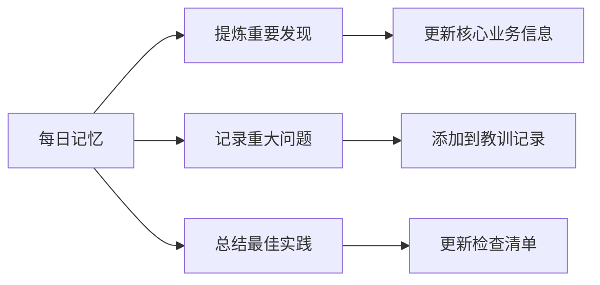

# 📅 每日记忆模板

## 🎯 如何使用本模板
1. **每日填写**：每天结束时或开始前填写
2. **定期回顾**：每周回顾一次，每月总结一次
3. **知识沉淀**：将重要发现记录到 `CORE_BUSINESS_INFO.md`
4. **教训转化**：将重要问题记录到 `LESSONS_LEARNED.md`

---

## 📝 基本信息
**日期**: {YYYY-MM-DD}  
**星期**: {周一/周二/周三/周四/周五/周六/周日}  
**填写人**: {填写人姓名}  
**填写时间**: {HH:MM}  
**天气/心情**: {天气状况和心情状态}  
**项目阶段**: {规划/开发/测试/部署/维护}

## 🎯 今日目标
### 主要目标（必须完成）
- [ ] **{目标1}**: {具体描述，预期结果，优先级}
- [ ] **{目标2}**: {具体描述，预期结果，优先级}
- [ ] **{目标3}**: {具体描述，预期结果，优先级}

### 次要目标（尽量完成）
- [ ] **{目标4}**: {具体描述，预期结果}
- [ ] **{目标5}**: {具体描述，预期结果}

### 学习目标
- [ ] **{学习1}**: {学习内容，学习方法}
- [ ] **{学习2}**: {学习内容，学习方法}

## 📊 今日进展
### 已完成（✅）
#### 技术任务
1. **{已完成任务1}**:
   - **完成情况**: {具体完成内容}
   - **成果**: {产出物或成果}
   - **耗时**: {花费时间}
   - **质量评估**: {完成质量评分/10}

2. **{已完成任务2}**:
   - **完成情况**: {具体完成内容}
   - **成果**: {产出物或成果}
   - **耗时**: {花费时间}
   - **质量评估**: {完成质量评分/10}

#### 业务任务
3. **{已完成任务3}**:
   - **业务价值**: {为业务带来的价值}
   - **相关方**: {涉及的相关方}
   - **反馈**: {收到的反馈}

### 进行中（⏳）
#### 当前任务
1. **{进行中任务1}**:
   - **当前进度**: {完成百分比}%
   - **当前状态**: {具体状态描述}
   - **预计完成**: {预计完成时间}
   - **阻碍**: {遇到的困难或阻碍}

2. **{进行中任务2}**:
   - **当前进度**: {完成百分比}%
   - **当前状态**: {具体状态描述}
   - **预计完成**: {预计完成时间}
   - **阻碍**: {遇到的困难或阻碍}

### 未开始（📅）
#### 延期任务
1. **{未开始任务1}**:
   - **延期原因**: {为什么没有开始}
   - **影响评估**: {对项目的影响}
   - **新计划**: {新的开始时间}

2. **{未开始任务2}**:
   - **延期原因**: {为什么没有开始}
   - **影响评估**: {对项目的影响}
   - **新计划**: {新的开始时间}

## 🚨 遇到的问题
### 技术问题
#### 问题1: {问题标题}
**发生时间**: {HH:MM}  
**影响范围**: {影响的功能或模块}  
**严重程度**: 🔴严重 / 🟡中等 / 🟢轻微  
**解决状态**: ✅已解决 / ⏳进行中 / ❌未解决  

**问题描述**:
```
{详细的错误信息或现象描述}
```

**复现步骤**:
1. {步骤1}
2. {步骤2}
3. {步骤3}

**根本原因**:
- {技术原因}
- {流程原因}
- {人为原因}

**解决方案**:
```python
# 解决方案代码或伪代码
def solve_problem():
    {解决方案描述}
```

**预防措施**:
- [ ] {措施1}
- [ ] {措施2}

### 业务问题
#### 问题2: {业务问题标题}
**相关方**: {涉及的相关方}  
**影响**: {对业务的影响}  
**紧急程度**: 高/中/低  

**问题描述**:
{业务问题详细描述}

**解决方案**:
{建议的解决方案}

**跟进计划**:
- [ ] {跟进步骤1}
- [ ] {跟进步骤2}

### 流程问题
#### 问题3: {流程问题标题}
**流程环节**: {哪个流程环节}  
**影响效率**: {对效率的影响程度}  

**问题描述**:
{流程问题详细描述}

**改进建议**:
{具体的改进建议}

**实施计划**:
- [ ] {实施步骤1}
- [ ] {实施步骤2}

## 💡 关键发现
### 技术发现
#### 发现1: {技术发现标题}
**发现内容**:
{详细的技术发现描述}

**技术细节**:
```python
# 相关代码或技术细节
def technical_detail():
    {技术实现细节}
```

**应用场景**:
- {应用场景1}
- {应用场景2}

**价值评估**:
- **技术价值**: {对技术的价值}
- **业务价值**: {对业务的价值}
- **复用价值**: {是否可以复用到其他项目}

#### 发现2: {另一个技术发现}
**类型**: {性能优化/安全发现/架构改进/其他}  
**重要性**: 高/中/低  

**详细描述**:
{详细描述}

**验证方法**:
{如何验证这个发现}

**行动计划**:
- [ ] {行动1}
- [ ] {行动2}

### 业务发现
#### 发现3: {业务发现标题}
**数据洞察**:
{从数据中发现的业务洞察}

**模式识别**:
{发现的业务模式或规律}

**机会点**:
{基于发现的机会点}

**风险点**:
{基于发现的风险点}

### 数据发现
#### 发现4: {数据发现标题}
**数据源**: {数据来源}  
**数据量**: {数据量大小}  
**数据质量**: {数据质量评估}

**发现内容**:
{具体的数据发现}

**数据验证**:
{如何验证数据的真实性}

**数据应用**:
{数据可以如何应用}

## 🧠 学习收获
### 技术学习
#### 学习1: {技术学习点}
**学习内容**:
{具体学习内容}

**学习资源**:
- {资源链接1}
- {资源链接2}

**实践应用**:
{如何在实际项目中应用}

**掌握程度**:
- [ ] 了解概念
- [ ] 能够使用
- [ ] 熟练掌握
- [ ] 能够教学

#### 学习2: {另一个技术学习}
**学习类型**: {新工具/新框架/新算法/最佳实践}  
**学习深度**: 浅层/中等/深入  

**关键收获**:
{最重要的收获}

**应用计划**:
{计划如何应用这个学习}

### 业务学习
#### 学习3: {业务知识学习}
**业务领域**: {哪个业务领域}  
**学习来源**: {从哪里学习到的}

**学习内容**:
{具体的业务知识}

**理解深度**:
{对业务的理解程度}

**应用价值**:
{这个知识对项目的价值}

### 个人成长
#### 成长1: {个人成长点}
**成长领域**: {沟通/领导力/解决问题/时间管理/其他}  

**具体表现**:
{具体的成长表现}

**反思**:
{对这次成长的反思}

**改进计划**:
{进一步的改进计划}

## 📋 明日计划
### 必须完成（🔴高优先级）
1. **{高优先级任务1}**:
   - **目标**: {具体目标}
   - **预期结果**: {期望的产出}
   - **依赖关系**: {依赖哪些条件}
   - **风险**: {可能的风险}

2. **{高优先级任务2}**:
   - **目标**: {具体目标}
   - **预期结果**: {期望的产出}
   - **依赖关系**: {依赖哪些条件}
   - **风险**: {可能的风险}

### 计划完成（🟡中优先级）
1. **{中优先级任务1}**:
   - **目标**: {具体目标}
   - **重要性**: {为什么重要}
   - **时间预估**: {预计花费时间}

2. **{中优先级任务2}**:
   - **目标**: {具体目标}
   - **重要性**: {为什么重要}
   - **时间预估**: {预计花费时间}

### 如果时间允许（🟢低优先级）
1. **{低优先级任务1}**:
   - **目标**: {具体目标}
   - **价值**: {完成后带来的价值}

2. **{低优先级任务2}**:
   - **目标**: {具体目标}
   - **价值**: {完成后带来的价值}

### 学习计划
1. **{学习计划1}**:
   - **学习内容**: {具体内容}
   - **学习方法**: {如何学习}
   - **学习目标**: {学习目标}

## 🔗 相关文件
### 创建的文件
1. **`{文件路径1}`**:
   - **内容**: {文件主要内容}
   - **用途**: {文件的用途}
   - **重要性**: 高/中/低

2. **`{文件路径2}`**:
   - **内容**: {文件主要内容}
   - **用途**: {文件的用途}
   - **重要性**: 高/中/低

### 修改的文件
1. **`{文件路径3}`**:
   - **修改内容**: {具体修改了什么}
   - **修改原因**: {为什么修改}
   - **影响范围**: {影响的范围}

2. **`{文件路径4}`**:
   - **修改内容**: {具体修改了什么}
   - **修改原因**: {为什么修改}
   - **影响范围**: {影响的范围}

### 引用的文件
1. **`{文件路径5}`**:
   - **引用内容**: {引用的具体内容}
   - **引用目的**: {为什么引用}
   - **相关上下文**: {相关的上下文}

2. **`{文件路径6}`**:
   - **引用内容**: {引用的具体内容}
   - **引用目的**: {为什么引用}
   - **相关上下文**: {相关的上下文}

## 📈 数据指标
### 执行数据
**开始时间**: {HH:MM}  
**结束时间**: {HH:MM}  
**总工作时长**: {X小时Y分钟}  
**有效工作时间**: {有效工作时间比例}%  
**中断次数**: {被打断的次数}

### 产出数据
**代码行数**: {新增/修改/删除}  
**文档字数**: {新增文档字数}  
**解决问题数**: {解决的问题数量}  
**创建文件数**: {创建的文件数量}  
**完成任务数**: {完成的任务数量}

### 质量数据
**代码质量评分**: {评分/10}  
**文档质量评分**: {评分/10}  
**测试覆盖率**: {覆盖率百分比}  
**错误率**: {错误数量/总操作数}  
**用户满意度**: {满意度评分}

### 效率数据
**任务完成率**: {完成任务数/总任务数}  
**计划偏差**: {实际进度-计划进度}  
**时间利用率**: {有效工作时间/总工作时间}  
**注意力集中度**: {集中工作的时长比例}

## 👥 协作记录
### 沟通记录
#### 沟通1: 与{人名}沟通
**时间**: {HH:MM}  
**方式**: {会议/电话/即时通讯/邮件}  
**主题**: {沟通主题}

**内容摘要**:
{沟通内容摘要}

**结果/决议**:
{达成的决议或结果}

**跟进事项**:
- [ ] {跟进事项1}
- [ ] {跟进事项2}

#### 沟通2: {另一个沟通}
**相关方**: {涉及的相关方}  
**重要性**: 高/中/低  

**详细记录**:
{详细沟通记录}

**关键信息**:
{关键信息点}

**行动项**:
{具体的行动项}

### 协作任务
#### 分配给{人名}的任务
1. **{任务1}**:
   - **内容**: {任务内容}
   - **截止时间**: {截止时间}
   - **状态**: {进行中/已完成/延期}
   - **跟进**: {是否需要跟进}

2. **{任务2}**:
   - **内容**: {任务内容}
   - **截止时间**: {截止时间}
   - **状态**: {进行中/已完成/延期}
   - **跟进**: {是否需要跟进}

#### 从{人名}接收的任务
1. **{任务3}**:
   - **内容**: {任务内容}
   - **要求**: {具体要求}
   - **状态**: {处理状态}
   - **完成时间**: {实际完成时间}

## 🎯 关键决策
### 技术决策
#### 决策1: {技术决策标题}
**决策时间**: {HH:MM}  
**决策人**: {决策人}  
**影响范围**: {影响的范围}

**决策内容**:
{具体的决策内容}

**决策理由**:
1. {理由1}
2. {理由2}
3. {理由3}

**备选方案**:
- **方案A**: {方案描述，为什么没选}
- **方案B**: {方案描述，为什么没选}

**风险评估**:
- **技术风险**: {技术层面的风险}
- **业务风险**: {业务层面的风险}
- **时间风险**: {时间层面的风险}

**执行计划**:
- [ ] {执行步骤1}
- [ ] {执行步骤2}

### 业务决策
#### 决策2: {业务决策标题}
**相关方**: {涉及的相关方}  
**紧急程度**: 高/中/低  

**决策背景**:
{决策的背景信息}

**决策内容**:
{具体的决策内容}

**预期效果**:
{预期的业务效果}

**衡量标准**:
{如何衡量决策的效果}

## 📝 备注
### 临时记录
1. **{备注1}**:
   {详细内容}

2. **{备注2}**:
   {详细内容}

### 灵感想法
1. **{灵感1}**:
   {灵感内容，可能的应用}

2. **{灵感2}**:
   {灵感内容，可能的应用}

### 待办事项
1. **{待办1}**:
   {具体内容，优先级}

2. **{待办2}**:
   {具体内容，优先级}

## 🔄 自动生成信息
**生成时间**: {时间戳}  
**生成工具**: {工具名称，如"手动填写"}  
**校验状态**: {校验结果}  
**关联项目**: {项目名称}  
**记忆索引**: {用于检索的关键词}

---

## 📊 每日总结

### 今日亮点
1. **{亮点1}**:
   {具体描述，为什么是亮点}

2. **{亮点2}**:
   {具体描述，为什么是亮点}

### 今日不足
1. **{不足1}**:
   {具体描述，改进建议}

2. **{不足2}**:
   {具体描述，改进建议}

### 今日感悟
{今日的工作感悟或思考}

### 明日改进
1. **{改进1}**:
   {具体改进措施}

2. **{改进2}**:
   {具体改进措施}

### 感谢对象
1. **感谢{人名}**:
   {感谢原因}

2. **感谢{团队/工具}**:
   {感谢原因}

---

## 🎯 完成状态评估

### 目标完成情况
| 目标类型 | 计划数 | 完成数 | 完成率 | 质量评估 |
|----------|--------|--------|--------|----------|
| 主要目标 | {数量} | {数量} | {百分比}% | {评分}/10 |
| 次要目标 | {数量} | {数量} | {百分比}% | {评分}/10 |
| 学习目标 | {数量} | {数量} | {百分比}% | {评分}/10 |

### 工作效率评估
**效率评分**: {评分}/10  
**专注度**: {专注度百分比}%  
**时间管理**: {时间管理评分}/10  
**产出质量**: {产出质量评分}/10

### 情绪状态
**开始情绪**: {开始时的情绪状态}  
**结束情绪**: {结束时的情绪状态}  
**情绪变化**: {情绪变化描述}  
**影响因素**: {影响情绪的因素}

### 健康状况
**睡眠质量**: {评分}/10  
**饮食情况**: {描述}  
**运动情况**: {描述}  
**精力状态**: {精力充沛程度}

---

## 📁 模板使用说明

### 填写指南
1. **每日必填项**:
   - 基本信息
   - 今日目标
   - 今日进展
   - 明日计划
   - 完成状态评估

2. **按需填写项**:
   - 遇到的问题（有问题时填写）
   - 关键发现（有发现时填写）
   - 学习收获（有学习时填写）
   - 协作记录（有协作时填写）

3. **定期填写项**:
   - 数据指标（每周总结时填写）
   - 情绪状态（每天结束时填写）
   - 健康状况（每天记录）

### 填写原则
1. **及时性**: 当天填写，不要拖延
2. **真实性**: 真实记录，不美化不掩饰
3. **完整性**: 重要信息要记录完整
4. **反思性**: 不仅记录事实，还要有反思
5. **行动性**: 记录的问题要有改进计划

### 回顾机制
1. **每日回顾**: 填写时回顾一天工作
2. **每周回顾**: 汇总一周的记忆，提炼重要信息
3. **每月回顾**: 分析月度趋势，更新核心业务信息
4. **项目回顾**: 项目结束时，整理所有记忆

### 与其他文档的联动


### 自动化建议
```bash
# 创建每日记忆文件的脚本
#!/bin/bash
DATE=$(date +%Y-%m-%d)
TEMPLATE="DAILY_MEMORY_TEMPLATE.md"
TARGET="memory/${DATE}.md"

cp "$TEMPLATE" "$TARGET"
sed -i "s/{YYYY-MM-DD}/$DATE/g" "$TARGET"
sed -i "s/{星期}/$(date +%A)/g" "$TARGET"

echo "✅ 已创建今日记忆文件: $TARGET"
```

---
**模板版本**: v1.0.0  
**最后更新**: {最后更新日期}  
**维护人**: {维护人姓名}  
**备注**: 这是一个通用每日记忆模板，请根据个人和项目需求进行定制。  
**重要**: 坚持每日填写，形成连续的记忆链。