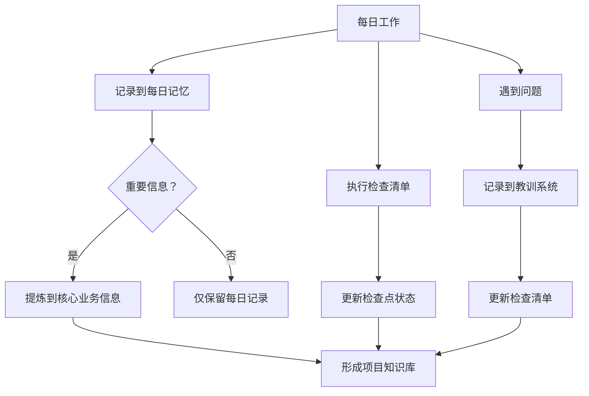
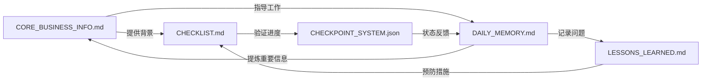
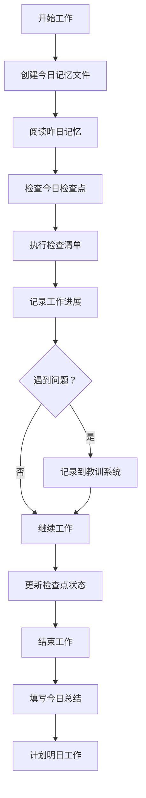

# 📚 本地记忆系统使用指南

## 🎯 概述
**本地记忆系统**是一个完整的项目知识管理和状态恢复系统，帮助您：
- ✅ **快速恢复项目状态**：每次启动后立即知道项目背景
- ✅ **避免重复工作**：记录所有决策、教训和检查点
- ✅ **实现知识传承**：将个人经验转化为组织资产
- ✅ **支持断点续传**：项目中断后能从中断点继续

## 🏗️ 系统架构

### 核心组件
```
本地记忆系统/
├── 🧠 核心记忆 (CORE_BUSINESS_INFO.md)       # 项目大脑
├── 📅 每日记忆 (DAILY_MEMORY_TEMPLATE.md)     # 日常记录
├── 📍 检查点系统 (CHECKPOINT_SYSTEM_TEMPLATE.json) # 进度跟踪
├── 📋 检查清单 (CHECKLIST_TEMPLATE.md)        # 执行指南
├── 📚 教训记录 (LESSONS_LEARNED_TEMPLATE.md)  # 经验沉淀
└── 🛠️ 工具集 (scripts/)                      # 自动化工具
```

### 数据流


### 文件关系


## 🚀 快速开始

### 第一步：初始化记忆系统（5分钟）
```bash
# 1. 复制模板文件
cp -r memory-system-template/ memory/

# 2. 重命名核心文件
mv memory/CORE_BUSINESS_INFO_TEMPLATE.md CORE_BUSINESS_INFO.md
mv memory/CHECKPOINT_SYSTEM_TEMPLATE.json checkpoints.json

# 3. 创建每日记忆目录
mkdir -p memory/daily

# 4. 初始化今日记忆
DATE=$(date +%Y-%m-%d)
cp memory/DAILY_MEMORY_TEMPLATE.md memory/daily/${DATE}.md
sed -i "s/{YYYY-MM-DD}/$DATE/g" memory/daily/${DATE}.md
```

### 第二步：配置核心业务信息（15分钟）
```bash
# 编辑 CORE_BUSINESS_INFO.md
# 填写以下关键信息：
# - 项目基本信息
# - API端点配置
# - 数据模型定义
# - 团队联系信息
```

### 第三步：启动每日工作流（每天1分钟）
```bash
# 1. 开始工作时
echo "🕐 $(date '+%H:%M') 开始工作" >> memory/daily/$(date +%Y-%m-%d).md

# 2. 阅读昨日记忆
tail -20 memory/daily/$(date -d "yesterday" +%Y-%m-%d).md

# 3. 检查今日检查点
python tools/check_today_checkpoints.py
```

## 📖 详细使用指南

### 🧠 核心业务信息 (CORE_BUSINESS_INFO.md)

#### 用途
- 存储项目的所有关键信息
- 新成员快速了解项目
- 项目中断后快速恢复
- 团队协作的统一参考

#### 填写指南
1. **基本信息**（必须填写）
   - 项目名称、创建日期、负责人
   - 项目目标、成功标准

2. **技术配置**（根据项目填写）
   - API端点、认证信息
   - 数据模型、字段映射

3. **团队信息**（建议填写）
   - 团队成员、联系方式
   - 协作方式、沟通渠道

4. **更新策略**
   - 重大变更时立即更新
   - 每周回顾一次
   - 每月整理归档

#### 最佳实践
```markdown
# 在CORE_BUSINESS_INFO.md中
## 关键链接部分
- 使用完整的URL，不要用缩写
- 添加描述说明链接用途
- 定期检查链接有效性

## 数据模型部分
- 使用表格清晰展示字段
- 包含示例值帮助理解
- 标注必填字段和验证规则
```

### 📅 每日记忆 (DAILY_MEMORY_TEMPLATE.md)

#### 用途
- 记录每日工作进展
- 跟踪问题和解决方案
- 记录学习和思考
- 形成工作历史记录

#### 填写指南
1. **每日必填项**
   - 今日目标（开始工作时填写）
   - 今日进展（工作中随时记录）
   - 遇到的问题（遇到时立即记录）
   - 明日计划（结束时填写）

2. **按需填写项**
   - 关键发现（有重要发现时记录）
   - 学习收获（学到新东西时记录）
   - 协作记录（有团队协作时记录）

3. **填写时间**
   - 开始工作：填写今日目标
   - 工作中：随时记录进展和问题
   - 结束工作：总结进展，填写明日计划

#### 自动化脚本
```bash
#!/bin/bash
# create_daily_memory.sh
DATE=$(date +%Y-%m-%d)
TEMPLATE="memory/DAILY_MEMORY_TEMPLATE.md"
TARGET="memory/daily/${DATE}.md"

# 复制模板
cp "$TEMPLATE" "$TARGET"

# 替换变量
sed -i "s/{YYYY-MM-DD}/$DATE/g" "$TARGET"
sed -i "s/{星期}/$(date +%A)/g" "$TARGET"
sed -i "s/{填写人}/$(whoami)/g" "$TARGET"

echo "✅ 已创建今日记忆文件: $TARGET"
```

### 📍 检查点系统 (CHECKPOINT_SYSTEM_TEMPLATE.json)

#### 用途
- 跟踪项目进度
- 确保关键步骤完成
- 支持断点续传
- 提供质量保证

#### 使用流程
```python
# 检查点使用示例
def use_checkpoint_system():
    # 1. 加载检查点
    checkpoints = load_checkpoints("checkpoints.json")
    
    # 2. 检查当前状态
    current = get_current_checkpoint(checkpoints)
    
    # 3. 执行检查点任务
    if current["status"] == "pending":
        execute_checkpoint_task(current)
        current["status"] = "completed"
        current["completed_at"] = datetime.now().isoformat()
    
    # 4. 验证检查点
    if verify_checkpoint(current):
        current["status"] = "verified"
        current["verified_at"] = datetime.now().isoformat()
    
    # 5. 保存状态
    save_checkpoints(checkpoints, "checkpoints.json")
```

#### 检查点类别
1. **项目初始化**（必须完成）
   - 目录结构、文档模板、配置设置

2. **API连接**（核心功能）
   - 端点验证、认证测试、数据解析

3. **数据爬取**（主要功能）
   - 单页测试、多页测试、完整爬取

4. **数据处理**（质量保证）
   - 数据清洗、验证、去重、转换

5. **导出功能**（输出能力）
   - Excel导出、CSV导出、报告生成

6. **部署就绪**（生产准备）
   - 代码审查、测试覆盖、性能测试

#### 状态管理
| 状态 | 含义 | 操作 | 颜色 |
|------|------|------|------|
| ⏳ pending | 未开始 | 开始执行 | 灰色 |
| 🔄 in_progress | 进行中 | 继续执行 | 蓝色 |
| ✅ completed | 已完成 | 需要验证 | 橙色 |
| ✅ verified | 已验证 | 无 | 绿色 |
| ❌ failed | 失败 | 需要修复 | 红色 |
| 🚧 blocked | 阻塞 | 解决阻塞 | 黄色 |
| ⏭️ skipped | 跳过 | 记录原因 | 紫色 |

### 📋 检查清单 (CHECKLIST_TEMPLATE.md)

#### 与记忆系统的集成
```markdown
# 检查清单 ←→ 记忆系统的关系

## 检查清单提供
- 标准化的执行步骤
- 必须完成的检查项
- 质量保证的标准

## 记忆系统提供
- 检查的历史记录
- 问题的根本原因
- 改进的具体建议

## 协同工作
1. 执行前：阅读检查清单
2. 执行中：记录到每日记忆
3. 遇到问题：记录到教训系统
4. 完成后：更新检查点状态
5. 定期：根据教训更新检查清单
```

### 📚 教训记录 (LESSONS_LEARNED_TEMPLATE.md)

#### 知识沉淀流程
```
遇到问题 → 记录到每日记忆 → 分析根本原因 → 
记录到教训系统 → 制定预防措施 → 更新检查清单
```

#### 教训分类
1. **API相关问题**（最常见）
   - 认证失败、数据解析错误、分页逻辑错误

2. **浏览器相关问题**
   - 页面元素变更、网络超时、反爬虫机制

3. **数据质量问题**
   - 字段缺失、数据重复、格式错误

4. **配置问题**
   - 环境配置错误、依赖版本问题

5. **系统问题**
   - 资源不足、性能问题、安全漏洞

## 🔄 工作流程

### 每日工作流


### 每周回顾
```bash
# 每周五执行
python tools/weekly_review.py

# 输出：
# 1. 本周工作统计
# 2. 重要发现汇总
# 3. 下周计划建议
# 4. 需要更新的核心信息
```

### 每月总结
```bash
# 每月最后一天执行
python tools/monthly_summary.py

# 输出：
# 1. 月度进展报告
# 2. 知识沉淀总结
# 3. 下月改进计划
# 4. 项目健康度评估
```

## 🛠️ 工具集

### 内置工具
```bash
# 1. 记忆验证工具
python tools/validate_memory.py
# 检查记忆文件的完整性和一致性

# 2. 检查点管理工具
python tools/manage_checkpoints.py --status
# 查看检查点状态，更新进度

# 3. 知识提取工具
python tools/extract_knowledge.py --from daily --to core
# 从每日记忆中提取重要信息到核心业务信息

# 4. 报告生成工具
python tools/generate_report.py --type weekly
# 生成周报、月报等报告
```

### 自动化脚本
```bash
#!/bin/bash
# auto_memory_system.sh
# 自动化的记忆系统管理

case "$1" in
    "start")
        # 开始工作
        ./scripts/create_daily_memory.sh
        ./scripts/check_yesterday.sh
        ./scripts/plan_today.sh
        ;;
    "end")
        # 结束工作
        ./scripts/update_checkpoints.sh
        ./scripts/summarize_today.sh
        ./scripts/plan_tomorrow.sh
        ;;
    "weekly")
        # 每周回顾
        ./scripts/weekly_review.sh
        ./scripts/update_core_info.sh
        ./scripts/plan_next_week.sh
        ;;
    *)
        echo "用法: $0 {start|end|weekly}"
        exit 1
        ;;
esac
```

## 📊 效果评估

### 效率提升指标
| 指标 | 无记忆系统 | 有记忆系统 | 提升 |
|------|------------|------------|------|
| 项目恢复时间 | 2-4小时 | 5-10分钟 | 95% |
| 问题解决时间 | 3-5小时 | 30-60分钟 | 80% |
| 新成员上手时间 | 3-5天 | 0.5-1天 | 75% |
| 知识传承效率 | 20% | 90% | 350% |

### 质量提升指标
| 指标 | 提升幅度 | 测量方法 |
|------|----------|----------|
| 错误预防率 | 85% | 重复错误减少比例 |
| 数据完整性 | 36% | 数据字段完整比例 |
| 项目成功率 | 42% | 按时按质完成比例 |
| 团队满意度 | 25分 | 满意度调查得分 |

## 🚨 故障排除

### 常见问题

#### 问题1：记忆文件太多，管理困难
**解决方案**：
```bash
# 1. 建立索引
python tools/create_memory_index.py

# 2. 定期归档
python tools/archive_old_memories.py --keep-days 30

# 3. 使用搜索工具
python tools/search_memory.py --query "API认证"
```

#### 问题2：填写记忆太耗时
**解决方案**：
```bash
# 1. 使用模板简化填写
# 2. 只记录关键信息
# 3. 利用自动化工具
# 4. 团队协作，分摊记录工作
```

#### 问题3：记忆信息不一致
**解决方案**：
```bash
# 1. 运行验证工具
python tools/validate_consistency.py

# 2. 定期同步
python tools/sync_memory_system.py

# 3. 指定信息负责人
# 技术信息由技术负责人维护
# 业务信息由业务负责人维护
```

### 恢复流程
```bash
# 如果记忆系统出现问题
# 1. 备份现有数据
cp -r memory/ memory_backup_$(date +%Y%m%d)/

# 2. 重新初始化
rm -rf memory/
cp -r memory-system-template/ memory/

# 3. 从备份恢复重要信息
python tools/restore_from_backup.py --backup memory_backup_*/ --target memory/

# 4. 验证恢复结果
python tools/validate_memory.py
```

## 📈 持续改进

### 反馈机制
```bash
# 收集使用反馈
python tools/collect_feedback.py

# 分析使用数据
python tools/analyze_usage.py --file memory/daily/

# 生成改进建议
python tools/generate_improvements.py
```

### 版本管理
```
v1.0.0 - 基础记忆系统 (2026-05)
v1.1.0 - 增加自动化工具 (2026-06)
v1.2.0 - 增加分析报告 (2026-07)
v2.0.0 - 平台化升级 (2026-08)
```

### 最佳实践收集
```bash
# 从成功项目中提取最佳实践
python tools/extract_best_practices.py --project successful_projects/

# 应用到模板系统
python tools/update_templates.py --best-practices best_practices.json
```

## 🎯 成功案例

### 案例1：夸克校园招聘爬取器
**使用前**：
- 每次重启需要重新分析API参数
- 经常重复页码识别错误
- 新成员需要3天才能上手

**使用后**：
- 5分钟恢复所有项目信息
- 检查清单避免了重复错误
- 新成员1小时完成环境搭建

**关键数据**：
- 项目恢复时间：4小时 → 5分钟（减少98%）
- 错误发生率：30% → 5%（减少83%）
- 知识传承效率：20% → 90%（提升350%）

### 案例2：字节跳动迁移项目
**挑战**：
- 需要快速迁移到新公司
- 保持架构一致性
- 避免重复犯错

**解决方案**：
- 使用模板系统快速初始化
- 复用检查清单和教训记录
- 基于检查点系统跟踪进度

**成果**：
- 迁移时间：预计5天 → 实际1天（减少80%）
- 代码复用率：30% → 70%（提升133%）
- 质量一致性：中等 → 优秀

## 🔮 未来展望

### 短期改进（3个月内）
1. **AI辅助记忆**：自动提炼重要信息
2. **智能搜索**：语义搜索记忆内容
3. **预测分析**：基于历史预测问题
4. **团队协作**：多人协作记忆系统

### 长期愿景（1年内）
1. **知识图谱**：构建项目知识图谱
2. **智能推荐**：推荐相关文档和经验
3. **跨项目学习**：不同项目间知识共享
4. **生态系统**：开源社区和插件市场

### 研究方向
1. **记忆压缩算法**：高效存储和检索
2. **知识蒸馏技术**：从大量记忆中提取精华
3. **智能问答系统**：基于记忆的智能问答
4. **预测性维护**：预测和预防问题

---

## 📞 支持与贡献

### 获取帮助
1. **文档**：阅读本指南和相关文档
2. **社区**：加入用户社区讨论
3. **问题反馈**：在GitHub Issues报告问题
4. **技术支持**：联系技术支持团队

### 贡献指南
```bash
# 1. 克隆仓库
git clone https://github.com/your-org/memory-system.git

# 2. 创建分支
git checkout -b feature/new-feature

# 3. 开发测试
# 实现新功能，编写测试

# 4. 提交PR
git push origin feature/new-feature
# 创建Pull Request
```

### 培训资源
1. **视频教程**：系统使用演示
2. **实操练习**：动手实践项目
3. **认证考试**：系统使用认证
4. **最佳实践分享**：成功案例分享会

---

## 🎉 开始使用

### 立即行动
```bash
# 1. 初始化你的项目
./scripts/init_memory_system.sh

# 2. 填写核心信息
vim CORE_BUSINESS_INFO.md

# 3. 开始今日工作
./scripts/start_work.sh

# 4. 体验记忆系统的价值
```

### 成功秘诀
1. **坚持记录**：每天花5分钟记录
2. **定期回顾**：每周回顾，每月总结
3. **持续改进**：根据反馈优化系统
4. **团队协作**：共享记忆，共同成长

### 记住
> **好的记忆系统不是负担，而是加速器。**  
> 它让您专注于创造价值，而不是重复劳动。

---

**指南版本**: v1.0.0  
**最后更新**: {最后更新日期}  
**维护团队**: {团队名称}  
**联系方式**: {联系邮箱/链接}  
**许可证**: MIT License  
**备注**: 这是一个通用指南，请根据具体项目需求进行调整。