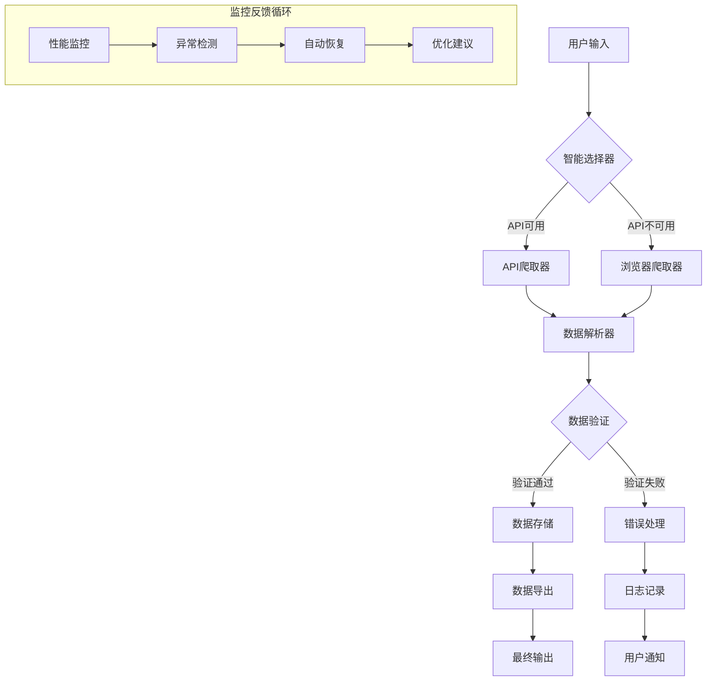

# 🏗️ 项目架构图模板

## 🎯 架构概览

### 📊 一页纸架构图
```
┌─────────────────────────────────────────────────────────────┐
│                    🎯 项目架构概览                           │
├─────────────────────────────────────────────────────────────┤
│                                                             │
│  ┌─────────────┐  ┌─────────────┐  ┌─────────────┐         │
│  │   用户界面   │  │  核心业务    │  │  数据存储    │         │
│  │  (User UI)  │  │  (Business) │  │  (Storage)  │         │
│  └──────┬──────┘  └──────┬──────┘  └──────┬──────┘         │
│         │                │                 │                │
│  ┌──────▼──────┐  ┌──────▼──────┐  ┌──────▼──────┐         │
│  │ 配置管理    │  │ API爬取器   │  │ 本地文件     │         │
│  │ Config      │◄─┤ API Crawler ├─►│ Local Files │         │
│  └──────┬──────┘  └──────┬──────┘  └──────┬──────┘         │
│         │                │                 │                │
│  ┌──────▼──────┐  ┌──────▼──────┐  ┌──────▼──────┐         │
│  │ 认证管理    │  │ 浏览器爬取器 │  │ 数据库      │         │
│  │ Auth        │◄─┤ Browser     ├─►│ Database    │         │
│  └─────────────┘  └──────┬──────┘  └──────┬──────┘         │
│                           │                 │                │
│                  ┌───────▼─────┐  ┌──────▼──────┐         │
│                  │ 错误处理    │  │ 数据导出    │         │
│                  │ Error       │  │ Export      │         │
│                  └─────────────┘  └─────────────┘         │
│                                                             │
└─────────────────────────────────────────────────────────────┘
```

## 🔧 技术架构

### 0. 系统优先原则（来自蚂蚁国际项目经验）
#### 核心认知
```yaml
系统认知:
  - 模板系统 = 完整工具箱，不是起点
  - 角色定位 = 系统配置师，不是开发者
  - 工作原则 = 系统优先，配置优先，避免重复开发
```

#### 系统功能检查原则
1. **检查现有功能**: 遇到问题先检查夸克模板系统是否有解决方案
2. **使用现有方案**: 优先使用模板系统的工具和脚本
3. **避免重复开发**: 不重新发明轮子，除非有明确的新需求
4. **配置优先**: 能通过配置解决的，不写新代码
5. **系统思维**: 以系统使用者的角度思考，而不是开发者

### 1. 核心架构模式
#### 混合爬取架构（API优先 + 浏览器备用）
```yaml
架构模式: 混合爬取 (Hybrid Crawling)
主要组件:
  - API爬取器: 优先使用，高效稳定
  - 浏览器爬取器: 备用方案，应对API限制
  - 智能选择器: 自动选择最佳爬取方式
  - 统一数据接口: 屏蔽底层差异
```

#### 分层架构设计
```
┌─────────────────────────────────────────┐
│           表现层 (Presentation)          │
├─────────────────────────────────────────┤
│ • 命令行界面 (CLI)                      │
│ • 配置文件 (JSON/YAML)                  │
│ • 日志输出                              │
├─────────────────────────────────────────┤
│           业务层 (Business)              │
├─────────────────────────────────────────┤
│ • 智能爬取选择器                        │
│ • 数据解析引擎                          │
│ • 错误处理机制                          │
│ • 进度管理                              │
├─────────────────────────────────────────┤
│           数据层 (Data)                  │
├─────────────────────────────────────────┤
│ • API客户端 (Requests)                  │
│ • 浏览器自动化 (Playwright/Selenium)    │
│ • 数据存储 (JSON/CSV/Excel)             │
│ • 缓存系统                              │
├─────────────────────────────────────────┤
│           基础设施层 (Infrastructure)    │
├─────────────────────────────────────────┤
│ • 配置管理                              │
│ • 日志系统                              │
│ • 监控告警                              │
│ • 备份恢复                              │
└─────────────────────────────────────────┘
```

### 2. 数据流架构


## 🧩 组件设计

### 1. 智能爬取选择器 (`smart_crawler_selector.py`)
#### 职责
- 检测API可用性
- 根据条件选择爬取方式
- 管理爬取会话状态
- 提供统一的数据接口

#### 接口设计
```python
class SmartCrawlerSelector:
    def __init__(self, config: Config):
        self.config = config
        self.api_crawler = APICrawler(config)
        self.browser_crawler = BrowserCrawler(config)
        
    def crawl_page(self, page: int) -> CrawlResult:
        """智能爬取单页数据"""
        # 1. 尝试API爬取
        result = self.api_crawler.crawl(page)
        if result.success:
            return result
            
        # 2. API失败时切换到浏览器
        self.logger.warning("API失败，切换到浏览器模式")
        return self.browser_crawler.crawl(page)
        
    def crawl_all(self, max_pages: int = 10) -> CrawlSummary:
        """爬取所有页面"""
        results = []
        for page in range(1, max_pages + 1):
            result = self.crawl_page(page)
            results.append(result)
            if not result.has_more:
                break
        return CrawlSummary(results)
```

### 2. API爬取器 (`api_crawler.py`)
#### 核心功能
- HTTP请求管理
- 认证处理（CSRF令牌、Cookie）
- 分页逻辑实现
- 错误重试机制

#### 配置结构
```json
{
  "api_endpoints": {
    "list": "https://api.example.com/positions",
    "detail": "https://api.example.com/position/{id}"
  },
  "authentication": {
    "csrf_token": "从URL参数获取",
    "cookies": {
      "SESSION": "会话Cookie"
    }
  },
  "pagination": {
    "page_param": "page",
    "size_param": "pageSize",
    "default_size": 10
  }
}
```

### 3. 浏览器爬取器 (`browser_crawler.py`)
#### 备用方案设计
```python
class BrowserCrawler:
    """浏览器备用爬取器"""
    
    def __init__(self, config: BrowserConfig):
        self.config = config
        self.browser = None
        
    def crawl(self, page: int) -> CrawlResult:
        """使用浏览器爬取单页"""
        if not self.browser:
            self.browser = self.launch_browser()
            
        # 导航到目标页面
        self.browser.goto(self.build_url(page))
        
        # 等待页面加载
        self.wait_for_content()
        
        # 提取数据
        data = self.extract_data()
        
        # 验证数据完整性
        if self.validate_data(data):
            return CrawlResult(success=True, data=data)
        else:
            return CrawlResult(success=False, error="数据验证失败")
            
    def launch_browser(self):
        """启动浏览器实例"""
        # 支持多种浏览器：Chrome、Firefox、Edge
        # 支持无头模式
        # 支持代理配置
```

### 4. 数据存储系统
#### 多格式存储设计
```
数据存储系统
├── 原始数据层 (Raw)
│   ├── JSON格式: 保持API原始响应
│   ├── 分页存储: 每页一个文件
│   └── 时间戳: 文件名包含时间戳
│
├── 处理数据层 (Processed)
│   ├── 合并文件: 所有数据合并
│   ├── 去重处理: 基于ID去重
│   └── 格式转换: JSON → CSV/Excel
│
├── 分析数据层 (Analytics)
│   ├── 统计报告: 数量、分布
│   ├── 趋势分析: 时间变化
│   └── 导出报告: 可视化图表
│
└── 备份恢复层 (Backup)
    ├── 定期备份: 每天/每周
    ├── 增量备份: 只备份变化
    └── 恢复机制: 数据丢失恢复
```

## 🔄 工作流程

### 1. 标准爬取流程
```python
# 完整工作流程示例
def standard_workflow():
    """标准爬取工作流程"""
    
    # 1. 初始化
    config = load_config("config/api_auth.json")
    crawler = SmartCrawlerSelector(config)
    
    # 2. 环境检查
    if not check_environment():
        raise EnvironmentError("环境检查失败")
        
    # 3. 认证测试
    if not test_authentication():
        raise AuthenticationError("认证失败")
        
    # 4. 分页爬取
    for page in range(1, MAX_PAGES + 1):
        result = crawler.crawl_page(page)
        
        if result.success:
            save_data(result.data, page)
            log_progress(page, len(result.data))
        else:
            handle_error(result.error, page)
            
        if not result.has_more:
            break
            
    # 5. 数据合并
    merge_data()
    
    # 6. 生成报告
    generate_report()
    
    # 7. 清理资源
    cleanup()
```

### 2. 错误恢复流程
```
错误处理流程：
1. 错误检测
   ├── 网络错误 (Timeout, ConnectionError)
   ├── API错误 (401, 403, 404, 500)
   ├── 数据错误 (解析失败，格式错误)
   └── 系统错误 (磁盘满，内存不足)

2. 错误分类
   ├── 可恢复错误 (网络波动，API限流)
   ├── 需要重试错误 (临时性失败)
   └── 不可恢复错误 (认证失效，API变更)

3. 恢复策略
   ├── 立即重试 (网络错误)
   ├── 延迟重试 (API限流)
   ├── 切换模式 (API → 浏览器)
   └── 人工干预 (认证失效)

4. 记录和告警
   ├── 详细日志记录
   ├── 错误统计报告
   ├── 阈值告警通知
   └── 修复建议生成
```

## 📈 性能架构

### 1. 并发处理设计
```python
# 并发爬取设计
class ConcurrentCrawler:
    """并发爬取器"""
    
    def __init__(self, max_workers: int = 3):
        self.max_workers = max_workers
        self.executor = ThreadPoolExecutor(max_workers)
        
    def crawl_concurrently(self, pages: List[int]) -> List[CrawlResult]:
        """并发爬取多页"""
        futures = []
        for page in pages:
            future = self.executor.submit(self.crawl_single_page, page)
            futures.append(future)
            
        results = []
        for future in as_completed(futures):
            try:
                result = future.result(timeout=30)
                results.append(result)
            except TimeoutError:
                logger.error("页面爬取超时")
                
        return results
```

### 2. 缓存策略
```
缓存层次结构：
┌─────────────────────────────────────┐
│         内存缓存 (Memory)            │
│  • 最近访问数据                     │
│  • 高频请求结果                     │
│  • 过期时间: 5分钟                  │
├─────────────────────────────────────┤
│         磁盘缓存 (Disk)              │
│  • 历史爬取数据                     │
│  • 解析后的数据                     │
│  • 过期时间: 24小时                 │
├─────────────────────────────────────┤
│         持久存储 (Persistent)        │
│  • 最终数据输出                     │
│  • 分析报告                         │
│  • 永久保存                         │
└─────────────────────────────────────┘

缓存失效策略：
• 时间失效: 基于时间戳过期
• 事件失效: API更新时失效
• 手动失效: 用户主动清除
• 空间失效: 缓存空间不足
```

### 3. 资源管理
```yaml
资源配额:
  内存使用: < 512MB
  CPU使用: < 50%
  网络带宽: < 1MB/s
  磁盘空间: < 1GB
  
资源监控:
  - 实时监控: 内存/CPU/网络
  - 阈值告警: 超过阈值时通知
  - 自动降级: 资源紧张时降级服务
  - 优雅退出: 资源耗尽时安全退出
```

## 🔒 安全架构

### 1. 认证安全
```
认证安全设计：
┌─────────────────────────────────────┐
│       多层认证保护                  │
├─────────────────────────────────────┤
│ 1. 环境变量存储敏感信息             │
│ 2. 配置文件加密存储                 │
│ 3. 访问令牌定期刷新                 │
│ 4. 失败尝试次数限制                 │
├─────────────────────────────────────┤
│       数据传输安全                  │
├─────────────────────────────────────┤
│ 1. HTTPS强制使用                   │
│ 2. 请求签名验证                     │
│ 3. 数据加密传输                     │
│ 4. 防重放攻击保护                   │
├─────────────────────────────────────┤
│       访问控制安全                  │
├─────────────────────────────────────┤
│ 1. IP白名单限制                     │
│ 2. 请求频率限制                     │
│ 3. 操作权限分级                     │
│ 4. 审计日志记录                     │
└─────────────────────────────────────┘
```

### 2. 数据安全
```python
# 数据安全处理示例
class DataSecurity:
    """数据安全处理器"""
    
    @staticmethod
    def sanitize_data(data: Dict) -> Dict:
        """数据清洗，移除敏感信息"""
        sanitized = data.copy()
        
        # 移除可能包含个人信息的字段
        sensitive_fields = ['phone', 'email', 'id_card', 'address']
        for field in sensitive_fields:
            if field in sanitized:
                sanitized[field] = '[REDACTED]'
                
        # 哈希处理唯一标识符
        if 'user_id' in sanitized:
            sanitized['user_id_hash'] = hashlib.sha256(
                sanitized['user_id'].encode()
            ).hexdigest()
            del sanitized['user_id']
            
        return sanitized
        
    @staticmethod
    def encrypt_data(data: Dict, key: str) -> str:
        """数据加密"""
        # 使用AES加密敏感数据
        cipher = AES.new(key.encode(), AES.MODE_GCM)
        ciphertext, tag = cipher.encrypt_and_digest(
            json.dumps(data).encode()
        )
        return base64.b64encode(cipher.nonce + tag + ciphertext).decode()
```

## 🚀 部署架构

### 1. 本地部署架构
```
本地部署结构：
project/
├── bin/                    # 可执行脚本
│   ├── start.sh           # 启动脚本
│   ├── stop.sh            # 停止脚本
│   └── monitor.sh         # 监控脚本
├── config/                 # 配置文件
│   ├── api_auth.json      # API认证
│   ├── project.json       # 项目配置
│   └── browser.json       # 浏览器配置
├── logs/                  # 日志文件
│   ├── app.log            # 应用日志
│   ├── error.log          # 错误日志
│   └── audit.log          # 审计日志
├── data/                  # 数据目录
│   ├── raw/              # 原始数据
│   ├── processed/        # 处理数据
│   └── backup/           # 备份数据
└── scripts/              # 工具脚本
    ├── backup.py         # 备份脚本
    ├── cleanup.py        # 清理脚本
    └── report.py         # 报告脚本
```

### 2. 云部署架构（可选）
```yaml
云部署配置:
  compute:
    type: serverless
    runtime: python3.9
    memory: 512MB
    timeout: 300s
    
  storage:
    raw_data: s3://bucket/raw/
    processed_data: s3://bucket/processed/
    logs: cloudwatch
    
  scheduling:
    trigger: cron(0 2 * * ? *)  # 每天2点运行
    retry_policy: 3次，间隔5分钟
    
  monitoring:
    metrics: [cpu, memory, requests, errors]
    alarms: [error_rate > 5%, latency > 30s]
    notifications: [email, slack]
```

## 📊 监控与运维

### 1. 监控指标体系
```python
# 监控指标定义
class Metrics:
    """监控指标"""
    
    # 性能指标
    REQUEST_LATENCY = "crawler.request.latency"
    REQUEST_SUCCESS_RATE = "crawler.request.success_rate"
    DATA_VOLUME = "crawler.data.volume"
    
    # 质量指标
    DATA_COMPLETENESS = "crawler.data.completeness"
    DATA_ACCURACY = "crawler.data.accuracy"
    DATA_FRESHNESS = "crawler.data.freshness"
    
    # 资源指标
    MEMORY_USAGE = "system.memory.usage"
    CPU_USAGE = "system.cpu.usage"
    DISK_USAGE = "system.disk.usage"
    
    # 业务指标
    PAGES_CRAWLED = "business.pages.crawled"
    POSITIONS_FOUND = "business.positions.found"
    SUCCESS_RATE = "business.success.rate"
```

### 2. 告警规则
```yaml
告警规则配置:
  紧急告警:
    - error_rate > 10% 持续5分钟
    - memory_usage > 90% 持续2分钟
    - 连续3次认证失败
    
  重要告警:
    - success_rate < 80% 持续10分钟
    - 数据量下降50% 相比昨日
    - 爬取时间超过2小时
    
  警告告警:
    - 单次API失败
    - 磁盘使用率 > 80%
    - 网络延迟 > 5秒
```

## 🔄 扩展性设计

### 1. 插件架构
```python
# 插件系统设计
class PluginSystem:
    """插件系统"""
    
    def __init__(self):
        self.plugins = {}
        
    def register_plugin(self, name: str, plugin: Plugin):
        """注册插件"""
        self.plugins[name] = plugin
        
    def execute_hook(self, hook_name: str, *args, **kwargs):
        """执行钩子"""
        results = []
        for plugin in self.plugins.values():
            if hasattr(plugin, hook_name):
                result = getattr(plugin, hook_name)(*args, **kwargs)
                results.append(result)
        return results

# 插件示例
class DataExportPlugin(Plugin):
    """数据导出插件"""
    
    def before_export(self, data):
        """导出前处理"""
        return self.validate_data(data)
        
    def after_export(self, filepath):
        """导出后处理"""
        return self.notify_export_complete(filepath)
```

### 2. 配置驱动
```json
{
  "extensions": {
    "data_sources": [
      {
        "name": "api_source",
        "type": "api",
        "config": "config/api_auth.json"
      },
      {
        "name": "browser_source",
        "type": "browser", 
        "config": "config/browser.json"
      }
    ],
    "exporters": [
      {
        "name": "json_exporter",
        "type": "json",
        "config": {"indent": 2}
      },
      {
        "name": "excel_exporter",
        "type": "excel",
        "config": {"sheet_name": "Positions"}
      }
    ],
    "notifiers": [
      {
        "name": "email_notifier",
        "type": "email",
        "config": {"recipients": ["admin@example.com"]}
      }
    ]
  }
}
```

## 📝 架构决策记录

### 决策1: 混合爬取架构
**时间**: 2026-05-20  
**决策**: 采用API优先，浏览器备用的混合架构  
**背景**: 
- 目标网站既有API接口，也有网页界面
- API效率高但可能有限制
- 浏览器灵活但速度慢

**权衡**:
- ✅ 优点: 最大兼容性，高可用性
- ❌ 缺点: 实现复杂度增加
- ⚖️ 权衡: 用复杂度换取可靠性

**影响**:
- 需要维护两种爬取方式
- 需要智能选择逻辑
- 测试工作量加倍

### 决策2: 配置驱动设计
**时间**: 2026-05-20  
**决策**: 采用完全配置驱动的设计  
**背景**:
- 不同公司有不同的API和网站结构
- 需要快速适配新目标

**权衡**:
- ✅ 优点: 高可配置性，易于迁移
- ❌ 缺点: 配置复杂，需要文档支持
- ⚖️ 权衡: 用配置复杂度换取灵活性

**影响**:
- 需要完善的配置模板
- 需要配置验证机制
- 用户需要学习配置语法

### 决策3: 本地优先存储
**时间**: 2026-05-20  
**决策**: 优先使用本地文件存储，而非数据库  
**背景**:
- 数据量不大（几千条记录）
- 需要简单部署
- 便于数据备份和迁移

**权衡**:
- ✅ 优点: 部署简单，无需数据库
- ❌ 缺点: 查询性能有限
- ⚖️ 权衡: 用查询功能换取部署简便

**影响**:
- 数据查询需要文件读取
- 大数据量时性能可能下降
- 需要实现文件版本管理

---

## 🎯 架构优化路线图

### 短期优化（1-2周）
1. **性能优化**
   - 实现请求并发
   - 添加数据缓存
   - 优化内存使用

2. **稳定性提升**
   - 完善错误恢复
   - 添加健康检查
   - 实现自动重试

### 中期扩展（1-2月）
1. **功能扩展**
   - 支持更多数据源
   - 添加数据清洗
   - 实现实时监控

2. **部署优化**
   - Docker容器化
   - 云部署支持
   - 自动化CI/CD

### 长期演进（3-6月）
1. **架构演进**
   - 微服务拆分
   - 消息队列集成
   - 分布式存储

2. **智能增强**
   - 机器学习优化
   - 智能调度
   - 预测性维护

---

## 📞 架构支持

### 问题诊断
```bash
# 架构问题诊断工具
./scripts/diagnose_architecture.py

# 输出架构健康报告
./scripts/architecture_report.py
```

### 性能分析
```bash
# 性能分析
python -m cProfile -o profile.stats main.py

# 内存分析
python -m memory_profiler main.py
```

### 架构审查
```bash
# 架构合规性检查
./scripts/architecture_audit.py

# 技术债务评估
./scripts/tech_debt_assessment.py
```

---

## 🚀 架构优化与演进（基于滴滴项目经验）

### 优化点1：Cookie管理与认证增强
#### 问题识别
- **SESSION过期问题**: 固定Cookie导致认证失败
- **无自动更新**: 需要手动获取新SESSION
- **单点故障**: 单一Cookie失效影响整个系统

#### 优化方案
```
┌─────────────────────────────────────┐
│       增强版Cookie管理系统          │
├─────────────────────────────────────┤
│ 原始系统: 固定Cookie → 认证失败      │
│ 优化系统: 动态Cookie池 → 高可用      │
└─────────────────────────────────────┘

组件增强:
1. Cookie有效性检查器
2. SESSION自动更新器  
3. 多Cookie轮换调度器
4. 过期预警通知器
```

#### 实施路径
1. **立即实施**: 在现有SmartCrawlerSelector中增强Cookie管理
2. **短期目标**: 开发独立的CookieManager模块
3. **长期目标**: 建立Cookie云服务，支持跨项目共享

### 优化点2：参数智能发现与验证
#### 问题识别
- **参数无文档**: jobType等参数需要手动发现
- **无验证机制**: 错误参数导致数据错误
- **知识未沉淀**: 参数映射未形成知识库

#### 优化方案
```
┌─────────────────────────────────────┐
│       参数智能发现系统              │
├─────────────────────────────────────┤
│ 手动发现 → 自动发现 → 智能推荐       │
└─────────────────────────────────────┘

功能模块:
1. 参数自动探测器
2. 参数验证器
3. 参数知识库
4. 智能推荐引擎
```

#### 实施路径
1. **立即实施**: 在CHECKLIST中添加参数验证检查项
2. **短期目标**: 开发参数发现工具
3. **长期目标**: 建立参数智能推荐系统

### 优化点3：数据质量保证体系
#### 问题识别
- **数据丢失风险**: 批量保存导致中断数据丢失
- **质量无保障**: 无实时数据验证
- **进度不精确**: 无法准确恢复进度

#### 优化方案
```
┌─────────────────────────────────────┐
│       数据质量保证体系              │
├─────────────────────────────────────┤
│ 实时保存 → 质量验证 → 断点续传       │
└─────────────────────────────────────┘

质量维度:
1. 完整性: 必填字段检查
2. 一致性: 数据格式验证
3. 准确性: 数据逻辑验证
4. 及时性: 实时保存机制
```

#### 实施路径
1. **立即实施**: 实现数据实时保存
2. **短期目标**: 开发数据质量检查工具
3. **长期目标**: 建立数据质量管理平台

### 优化点4：监控与预警系统
#### 问题识别
- **无实时监控**: 问题发现滞后
- **无预警机制**: 被动响应问题
- **无趋势分析**: 无法预测问题

#### 优化方案
```
┌─────────────────────────────────────┐
│       智能监控预警系统              │
├─────────────────────────────────────┤
│ 实时监控 → 智能预警 → 趋势分析       │
└─────────────────────────────────────┘

监控维度:
1. 系统监控: 资源使用、性能指标
2. 业务监控: 数据质量、爬取进度
3. 安全监控: 认证状态、访问频率
4. 趋势监控: 变化趋势、异常检测
```

#### 实施路径
1. **立即实施**: 添加基础监控日志
2. **短期目标**: 开发监控仪表板
3. **长期目标**: 建立智能预警系统

### 架构演进路线图
#### 阶段1：基础优化（1-2周）
- ✅ 增强CHECKLIST.md（Cookie、参数、数据质量检查项）
- ✅ 更新LESSONS_LEARNED.md（滴滴项目教训）
- 🔄 在现有框架中增强Cookie管理
- 🔄 实现数据实时保存

#### 阶段2：模块增强（1个月）
1. **Cookie管理增强**:
   - 🔄 开发独立的CookieManager模块
   - 🔄 实现多Cookie轮换策略
   - 🔄 添加过期自动更新

2. **参数智能发现**:
   - 🔄 开发参数发现工具
   - 🔄 建立参数验证机制
   - 🔄 创建参数知识库

3. **数据质量保证**:
   - 🔄 开发数据质量检查工具
   - 🔄 实现实时数据验证
   - 🔄 建立断点续传机制

4. **基础监控系统**:
   - 🔄 开发监控仪表板
   - 🔄 实现基础预警
   - 🔄 添加性能监控

#### 阶段3：系统完善（3个月）
1. **服务化升级**:
   - 🔄 建立Cookie云服务
   - 🔄 建立参数知识库服务
   - 🔄 建立数据质量管理平台

2. **智能化增强**:
   - 🔄 建立智能预警系统
   - 🔄 实现异常自动检测
   - 🔄 开发趋势分析工具

3. **生态建设**:
   - 🔄 建立模板更新机制
   - 🔄 开发经验反哺工具
   - 🔄 构建知识共享平台

#### 阶段4：智能演进（6个月）
1. **智能推荐**:
   - 🔄 开发智能参数推荐
   - 🔄 实现自适应爬取策略
   - 🔄 构建智能调度系统

2. **预测性维护**:
   - 🔄 实现预测性维护
   - 🔄 建立健康度评估
   - 🔄 开发自愈机制

3. **知识图谱**:
   - 🔄 构建爬取知识图谱
   - 🔄 建立智能决策系统
   - 🔄 实现跨项目知识迁移

### 向后兼容性保证
#### 兼容性原则
1. **配置驱动**: 所有增强功能通过配置控制
2. **渐进增强**: 核心框架保持不变，插件方式增强
3. **平滑升级**: 现有项目无需修改即可使用
4. **文档同步**: 所有增强功能都有详细文档

#### 升级指南
```bash
# 基础升级（保持兼容）
# 1. 更新模板文档
cp enhanced_docs/*.md existing_project/docs/

# 2. 添加增强模块（可选）
cp -r enhanced_modules existing_project/

# 3. 配置启用增强功能
# 在config/enhanced_features.json中设置:
{
  "enable_cookie_manager": true,
  "enable_data_validation": true,
  "enable_monitoring": false
}
```

### 经验反哺机制
#### 知识沉淀流程
```
新项目经验 → 教训记录 → 检查清单更新 → 模板优化 → 新项目受益
```

#### 反哺工具
1. **经验提取工具**: 从项目日志中提取教训
2. **模板更新工具**: 自动更新模板文档
3. **知识同步工具**: 同步到所有相关项目
4. **质量检查工具**: 验证经验应用效果

#### 反哺流程
1. **项目执行**: 在新项目中应用模板
2. **问题发现**: 记录到LESSONS_LEARNED.md
3. **经验提取**: 使用工具提取关键教训
4. **模板更新**: 更新CHECKLIST.md等模板
5. **质量验证**: 验证更新后的模板
6. **知识共享**: 同步到所有相关项目

---

**架构版本**: v1.1.0（增强版）  
**最后更新**: 2026-05-22  
**架构师**: 夸克模板系统 + 滴滴项目经验  
**状态**: ✅ 生产就绪 + 🚀 优化演进中  
**目标**: 提供清晰、可扩展、可维护的架构指导，并持续优化演进

**核心优化总结**:
1. 🍪 **Cookie管理增强**: 动态Cookie池、自动更新、多轮换
2. 🎯 **参数智能发现**: 自动探测、验证、知识库
3. 📊 **数据质量保证**: 实时保存、完整性检查、断点续传
4. 🔔 **智能监控预警**: 实时监控、智能预警、趋势分析
5. 🔄 **经验反哺机制**: 教训沉淀、模板更新、知识共享

**适用项目**:
- ✅ 新项目: 直接使用优化版模板
- ✅ 现有项目: 渐进升级，保持兼容
- ✅ 大型项目: 支持模块化增强
- ✅ 复杂场景: 支持智能化演进