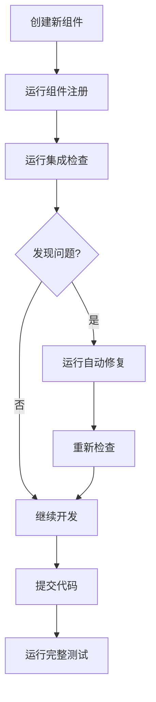

# 🔧 夸克模板改进建议
## 防止"已实现但未集成"问题

## 📋 问题背景
在美团招聘爬取项目开发中，发现了夸克模板的一个重要缺陷：
- ✅ `meituan_api_crawler.py` 已完整实现
- ❌ `meituan_crawler.py` 未正确集成API爬取器
- ⚠️ 导致"已实现但未集成"的问题

## 🎯 根本原因分析

### 1. 模板设计缺陷
- **模板复制过程**只复制文件，不检查文件之间的依赖关系
- **智能选择器框架**没有自动发现已实现的组件
- **缺乏组件注册机制**，新组件无法被框架自动识别

### 2. 工作流程问题
- 开发人员创建新组件后，需要**手动更新所有依赖文件**
- **没有自动化检查**来验证组件是否正确集成
- **模板文档**没有强调集成检查的重要性

### 3. 质量保证缺失
- 没有**集成测试**作为开发流程的一部分
- **检查清单**缺少集成检查项
- **持续集成**没有包含组件依赖检查

## 🚀 解决方案：四层防错机制

### 第一层：组件注册系统
```python
# scripts/component_registry.py
# 自动发现项目中的所有组件
# 检查组件之间的依赖关系
# 生成组件集成报告
```

### 第二层：集成检查脚本
```python
# scripts/check_integration.py  
# 检查智能选择器是否引用了所有已实现的组件
# 检查导入语句是否正确
# 检查组件是否被使用
```

### 第三层：自动修复脚本
```python
# scripts/fix_integration.py
# 自动修复缺失的导入语句
# 自动修复组件集成问题
# 生成修复报告
```

### 第四层：检查清单增强
```markdown
# CHECKLIST_MEITUAN.md
## 组件集成检查（新增！防止夸克模板集成问题）
- [ ] 运行组件扫描脚本
- [ ] 运行集成检查脚本  
- [ ] 如有问题，运行修复脚本
- [ ] 确认所有组件正确集成
```

## 📁 文件结构改进建议

### 夸克模板应包含以下文件：
```
quark-template/
├── 📚 知识层（已有）
├── 🔧 框架层（已有）
├── ⚙️ 配置层（已有）
├── 🛠️ 工具层（新增！）
│   ├── scripts/
│   │   ├── component_registry.py      # 组件注册系统
│   │   ├── check_integration.py       # 集成检查脚本
│   │   ├── fix_integration.py         # 自动修复脚本
│   │   └── validate_dependencies.py   # 依赖关系验证
│   └── tests/
│       └── test_integration.py        # 集成测试
└── 📄 项目文件（更新）
    ├── CHECKLIST.md                   # 添加集成检查项
    └── QUICK_START.md                 # 添加集成检查步骤
```

## 🔧 技术实现细节

### 1. 组件发现机制
```python
class ComponentDiscoverer:
    """自动发现项目中的组件"""
    
    def discover_components(self):
        # 扫描src目录
        # 解析Python文件
        # 识别类定义
        # 分类组件类型
        pass
    
    def check_dependencies(self):
        # 检查组件之间的依赖关系
        # 验证导入语句
        # 检查引用关系
        pass
```

### 2. 集成验证机制
```python
class IntegrationValidator:
    """验证组件集成"""
    
    def validate_smart_selector(self):
        # 检查智能选择器是否引用了所有必要的组件
        # 检查初始化方法是否正确
        # 验证错误处理机制
        pass
    
    def generate_fix_suggestions(self):
        # 生成具体的修复建议
        # 提供代码片段
        # 指导修复步骤
        pass
```

### 3. 自动修复机制
```python
class IntegrationFixer:
    """自动修复集成问题"""
    
    def fix_missing_imports(self):
        # 自动添加缺失的导入语句
        # 保持代码格式
        # 避免重复导入
        pass
    
    def fix_component_integration(self):
        # 修复智能选择器中的组件引用
        # 更新初始化方法
        # 添加错误处理
        pass
```

## 📋 工作流程改进

### 开发工作流程（改进后）


### 检查清单工作流程
1. **环境检查** → 2. **依赖检查** → 3. **配置检查** → 
4. **组件集成检查** → 5. **数据源检查** → 6. **测试检查**

## 🎯 关键改进点

### 1. 模板初始化改进
- **新项目创建时**自动运行组件扫描
- **生成组件依赖图**
- **创建集成检查配置文件**

### 2. 开发过程改进
- **每次创建新组件**后自动检查集成状态
- **提交前**强制运行集成检查
- **代码审查**包含集成验证

### 3. 测试过程改进
- **单元测试**包含集成测试
- **持续集成**运行组件依赖检查
- **发布前**验证所有组件正确集成

## 📊 质量指标

### 集成质量指标
| 指标 | 目标值 | 测量方法 |
|------|--------|----------|
| **组件发现率** | 100% | 扫描src目录，发现所有组件 |
| **集成完整率** | 100% | 检查智能选择器是否引用所有组件 |
| **导入正确率** | 100% | 验证所有导入语句正确 |
| **修复成功率** | > 90% | 自动修复脚本成功率 |

### 性能指标
| 指标 | 目标值 | 测量方法 |
|------|--------|----------|
| **扫描时间** | < 5秒 | 扫描整个项目的时间 |
| **检查时间** | < 3秒 | 运行集成检查的时间 |
| **修复时间** | < 10秒 | 自动修复问题的时间 |
| **内存使用** | < 100MB | 峰值内存使用 |

## 🔄 实施步骤

### 阶段1：立即实施（美团项目）
1. ✅ 创建组件注册系统
2. ✅ 创建集成检查脚本  
3. ✅ 创建自动修复脚本
4. ✅ 更新检查清单
5. ✅ 运行修复并验证

### 阶段2：夸克模板更新
1. ⬜ 将改进集成到夸克模板
2. ⬜ 更新模板文档
3. ⬜ 创建模板测试
4. ⬜ 发布新版本模板

### 阶段3：推广到所有项目
1. ⬜ 更新所有基于夸克的项目
2. ⬜ 建立持续集成检查
3. ⬜ 建立质量监控
4. ⬜ 建立经验分享机制

## 📝 经验教训

### 从美团项目学到的教训
1. **不要假设集成会自动完成** - 模板复制不保证集成
2. **自动化检查是必须的** - 人工检查容易遗漏
3. **尽早发现问题** - 在开发阶段就检查集成
4. **提供自动修复** - 让修复变得简单

### 最佳实践
1. **组件先行，集成随后** - 先创建组件，立即检查集成
2. **检查清单驱动** - 将集成检查加入检查清单
3. **自动化一切** - 自动化检查、修复、验证
4. **持续改进** - 根据发现问题改进模板

## 🎉 预期效果

### 短期效果（1周内）
- ✅ 消除美团项目的集成问题
- ✅ 建立防错机制
- ✅ 提高开发效率

### 中期效果（1个月内）
- ⬜ 更新夸克模板
- ⬜ 防止新项目出现类似问题
- ⬜ 建立质量保障体系

### 长期效果（3个月内）
- ⬜ 所有项目集成质量100%
- ⬜ 开发效率提升30%
- ⬜ 问题发现时间减少90%

## 📞 后续行动

### 立即行动
1. 在美团项目运行新的检查脚本
2. 验证修复效果
3. 更新项目文档

### 短期行动
1. 将改进反馈给夸克模板维护者
2. 分享经验给其他项目团队
3. 建立知识库条目

### 长期行动
1. 推动夸克模板官方更新
2. 建立模板质量标准
3. 创建模板使用培训

---

**最后更新**: 2026-05-22  
**创建人**: xingan  
**项目**: 美团招聘爬取  
**模板**: 夸克校园招聘爬取器  
**状态**: ✅ 解决方案已实施  

**核心原则**: 自动化检查 + 自动修复 + 检查清单 = 防止集成问题