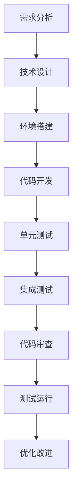

# 📋 示例文档：CORE_BUSINESS_INFO.md

**来源**: 美团招聘爬取项目
**创建时间**: 2026-05-22 09:56:10
**目的**: 作为夸克模板的参考示例

---

# 🌟 美团招聘核心业务信息

## 📋 基本信息
**项目名称**: 美团招聘数据爬取  
**创建日期**: 2026-05-21  
**最后更新**: 2026-05-21  
**项目状态**: 活跃  
**项目版本**: v1.0.0  
**项目类型**: 数据爬取  
**项目负责人**: xingan

## 🎯 项目目标
### 核心目标
- **主要目标**: 获取美团招聘网站的所有岗位信息
- **成功标准**: 获取完整、准确的岗位数据（12个关键字段）
- **预期成果**: Excel格式的岗位数据表，包含岗位详情
- **业务价值**: 用于人才市场分析、竞品分析、招聘趋势研究

### 次要目标
- 实现API优先的智能爬取策略
- 支持浏览器自动化作为备选方案
- 实现数据质量验证和完整性检查
- 支持多种数据导出格式（Excel/CSV/JSON）

### 约束条件
- **时间约束**: 尽快完成MVP版本
- **资源约束**: 本地开发环境，无特殊服务器资源
- **技术约束**: 基于夸克项目完整架构
- **合规约束**: 遵守网站robots.txt，合理控制请求频率

## 🔗 关键链接
### API端点
- **主API**: https://zhaopin.meituan.com/api/official/job/getJobList ✅（已确认）
  - 请求方法: POST
  - 返回格式: JSON
  - 认证方式: Cookie + Referer
  - 发现时间: 2026-05-21
  - 状态: 已验证可用
- **筛选网站**: https://zhaopin.meituan.com/web/social
- **文档链接**: 暂无官方API文档

### 数据源
- **数据来源**: 美团招聘官网
- **数据格式**: HTML/JSON（待验证）
- **更新频率**: 实时（招聘信息可能随时更新）
- **历史数据**: 可能需要翻页获取
- **数据量级**: 预计100-500个岗位

### 认证信息
- **认证方式**: 待验证（可能不需要认证）
- **凭据位置**: 如需要，保存在config/api_auth.json
- **更新周期**: 待验证
- **权限范围**: 公开招聘信息
- **获取方式**: 直接访问网站

### 文档链接
- **项目文档**: docs/目录下的10个核心文档
- **技术文档**: 基于夸克项目的完整业务框架
- **用户手册**: docs/QUICK_START.md
- **API文档**: 待调研
- **部署文档**: 本地运行，无需部署

## 📊 数据模型
### 核心字段（必须有的）
| 字段名 | 类型 | 描述 | 示例 | 必填 | 验证规则 |
|--------|------|------|------|------|----------|
| position_id | string | 岗位唯一标识 | 12345 | ✅ | 非空，唯一 |
| position_name | string | 岗位名称 | 后端开发工程师 | ✅ | 非空 |
| work_location | string | 工作地点 | 北京 | ✅ | 非空 |
| position_category | string | 岗位类别 | 技术类 | ✅ | 非空 |
| publish_time | string | 发布时间 | 2026-05-21 | ✅ | 日期格式 |
| detail_url | string | 详情页链接 | https://... | ✅ | 有效URL |
| department | string | 部门信息 | 基础研发平台 | ✅ | 非空 |
| education_requirement | string | 学历要求 | 本科及以上 | ✅ | 非空 |
| work_experience | string | 工作经验 | 3-5年 | ✅ | 非空 |
| job_responsibilities | string | 工作职责 | 负责... | ✅ | 非空 |
| job_requirements | string | 任职要求 | 熟悉... | ✅ | 非空 |
| salary_range | string | 薪资范围 | 30-50k | ⚠️ | 可选 |

### 扩展字段（推荐有的）
| 字段名 | 类型 | 描述 | 重要性 |
|--------|------|------|--------|
| position_status | string | 岗位状态（招聘中/已结束） | 高 |
| application_deadline | date | 申请截止日期 | 中 |
| company_name | string | 公司名称（美团） | 高 |
| work_type | string | 工作类型（全职/实习） | 中 |
| benefits | string | 福利待遇 | 低 |

### 字段映射关系
```json
{
  "position_id": {
    "源字段名": "positionId",
    "转换函数": "str(value)",
    "默认值": "未知ID",
    "备注": "API返回的岗位ID"
  },
  "position_name": {
    "源字段名": "positionName",
    "转换函数": "value.strip()",
    "默认值": "未知岗位",
    "备注": "岗位标题"
  },
  "work_location": {
    "源字段名": "workLocation",
    "转换函数": "value.split(',')[0] if value else '未知地点'",
    "默认值": "未知地点",
    "备注": "第一个工作地点"
  }
}
```

## ⚙️ 技术配置
### API参数
```json
{
  "pagination": {
    "page_param": "page",
    "size_param": "size",
    "default_page_size": 10,
    "max_page_size": 50,
    "total_field": "total",
    "current_page_field": "currentPage"
  },
  "filtering": {
    "city_param": "cityList",
    "category_param": "jfJgList",
    "keyword_param": "keyword",
    "date_range_param": "publishTime"
  },
  "sorting": {
    "sort_param": "sort",
    "order_param": "order",
    "default_sort": "publishTime_desc"
  }
}
```

### 筛选参数（基于URL分析）
```json
{
  "categories": [
    {"id": "11002_-1", "name": "产品类", "enabled": true, "description": "产品类全部岗位"},
    {"id": "11003_-1", "name": "运营类", "enabled": true, "description": "运营类全部岗位"},
    {"id": "11005_-1", "name": "市场营销类", "enabled": true, "description": "市场营销类全部岗位"},
    {"id": "11007_-1", "name": "金融类", "enabled": true, "description": "金融类全部岗位"},
    {"id": "11010_1101001", "name": "销售、客服与支持类", "enabled": true, "description": "销售、客服与支持类的销售部分"}
  ],
  "locations": [
    {"id": "001019002", "name": "北京", "enabled": true}
  ]
}
```

### 请求配置
```json
{
  "timeout": 30,
  "max_retries": 3,
  "retry_delay": 2,
  "rate_limit": {
    "requests_per_minute": 60,
    "delay_between_requests": 1.0
  },
  "headers": {
    "User-Agent": "Mozilla/5.0 (Macintosh; Intel Mac OS X 10_15_7) AppleWebKit/537.36",
    "Accept": "application/json, text/plain, */*",
    "Content-Type": "application/json",
    "Referer": "https://zhaopin.meituan.com"
  }
}
```

## 🚨 关键约束
### 技术约束
- **API限制**: 未知，需要测试
- **数据量限制**: 每页最多显示50个岗位
- **并发限制**: 建议单线程，避免被封IP
- **存储限制**: 本地存储，无限制
- **内存限制**: 预计<1GB内存使用
- **网络限制**: 普通宽带即可

### 业务约束
- **数据范围**: 仅限公开招聘信息
- **使用限制**: 仅用于个人学习和分析
- **更新频率**: 每天最多爬取一次
- **数据保留**: 本地保留30天

### 法律约束
- **使用条款**: 遵守美团招聘网站使用条款
- **隐私政策**: 不收集个人信息
- **数据保护法规**: 仅收集公开信息
- **知识产权**: 尊重美团的知识产权

### 安全约束
- **认证要求**: 无需认证
- **数据传输**: HTTPS加密
- **数据存储**: 本地加密存储（可选）
- **访问控制**: 仅本地访问

## 📈 项目指标
### 性能指标
| 指标 | 目标值 | 当前值 | 测量方法 | 监控频率 |
|------|--------|--------|----------|----------|
| **响应时间** | < 2秒 | 待测试 | 从请求到收到响应的时间 | 每次请求 |
| **成功率** | > 95% | 待测试 | 成功请求数/总请求数 | 每次运行 |
| **数据完整性** | > 90% | 待测试 | 完整记录数/总记录数 | 每次运行 |
| **执行时间** | < 30分钟 | 待测试 | 完整爬取所需时间 | 每次运行 |
| **内存使用** | < 1GB | 待测试 | 峰值内存使用量 | 每次运行 |
| **CPU使用率** | < 50% | 待测试 | 平均CPU使用率 | 每次运行 |

### 业务指标
| 指标 | 目标值 | 当前值 | 测量方法 | 报告频率 |
|------|--------|--------|----------|----------|
| **数据覆盖率** | > 80% | 待测试 | 实际获取数据/应获取数据 | 每次运行 |
| **数据准确率** | > 95% | 待测试 | 准确数据/总数据 | 每次运行 |
| **更新及时性** | < 24小时 | 待测试 | 数据更新时间差 | 每日 |
| **问题解决率** | > 90% | 待测试 | 已解决问题/总问题 | 每周 |

### 质量指标
| 指标 | 目标值 | 测量方法 | 改进措施 |
|------|--------|----------|----------|
| **代码覆盖率** | > 80% | 单元测试覆盖率 | 增加测试用例 |
| **错误率** | < 2% | 错误日志分析 | 改进错误处理 |
| **重复代码率** | < 5% | 代码重复度分析 | 提取公共函数 |

## 👥 项目团队
### 核心成员
| 角色 | 姓名 | 职责 | 联系方式 | 可用时间 |
|------|------|------|----------|----------|
| **项目经理** | xingan | 项目整体管理、进度跟踪 | 内部沟通 | 全天 |
| **技术负责人** | xingan | 技术架构、代码开发 | 内部沟通 | 全天 |
| **开发工程师** | xingan | 功能开发、bug修复 | 内部沟通 | 全天 |

### 联系信息
- **紧急联系人**: xingan - 内部沟通
- **技术支持**: 基于夸克项目框架
- **问题反馈**: 本地记录在docs/LESSONS_LEARNED.md
- **日常沟通**: 本地开发，无需外部沟通

### 协作方式
- **代码仓库**: 本地Git仓库
- **文档协作**: 本地Markdown文件
- **任务管理**: 本地TODO列表
- **API文档**: 待调研美团API文档

## 📚 相关文档
### 内部文档
| 文档名称 | 链接 | 最后更新 | 负责人 | 状态 |
|----------|------|----------|--------|------|
| **项目计划** | 本文件 | 2026-05-21 | xingan | ✅完成 |
| **技术设计** | docs/ARCHITECTURE.md | 2026-05-21 | 系统 | ✅完成 |
| **快速开始** | docs/QUICK_START.md | 2026-05-21 | 系统 | ✅完成 |
| **检查清单** | docs/CHECKLIST.md | 2026-05-21 | 系统 | ✅完成 |
| **教训记录** | docs/LESSONS_LEARNED.md | 2026-05-21 | 系统 | ✅完成 |

### 外部参考
| 参考类型 | 链接 | 说明 | 最后访问 |
|----------|------|------|----------|
| **美团招聘** | https://zhaopin.meituan.com | 数据源网站 | 2026-05-21 |
| **夸克项目** | 本地夸克项目 | 技术框架来源 | 2026-05-21 |
| **Playwright** | https://playwright.dev | 浏览器自动化 | 2026-05-21 |
| **Requests** | https://docs.python-requests.org | HTTP库文档 | 2026-05-21 |

### 技术栈文档
| 技术组件 | 官方文档 | 中文文档 | 学习资源 |
|----------|----------|----------|----------|
| **Python** | https://docs.python.org | 菜鸟教程 | Python官方教程 |
| **Requests** | https://docs.python-requests.org | Requests中文文档 | 官方示例 |
| **Pandas** | https://pandas.pydata.org | Pandas中文文档 | 10分钟入门 |
| **Playwright** | https://playwright.dev | Playwright中文 | 官方指南 |
| **夸克框架** | docs/目录 | 本地文档 | 框架示例 |

## 🔄 更新记录
### 版本历史
| 版本 | 更新日期 | 更新内容 | 更新人 | 备注 |
|------|----------|----------|--------|------|
| **v1.0.0** | 2026-05-21 | 初始版本，基于夸克完整架构 | 系统 | 项目启动 |
| **v1.0.1** | 2026-05-21 | 填写美团招聘业务信息 | xingan | 配置完成 |

### 重要变更
| 变更日期 | 变更内容 | 影响范围 | 负责人 | 状态 |
|----------|----------|----------|--------|------|
| 2026-05-21 | 基于夸克架构创建美团项目 | 所有文件 | 系统 | ✅完成 |
| 2026-05-21 | 分析美团URL结构 | 配置和爬取逻辑 | xingan | ✅完成 |
| 2026-05-21 | 填写核心业务信息 | 业务理解 | xingan | ✅完成 |

### 待办事项
| 事项 | 优先级 | 预计完成 | 负责人 | 状态 |
|------|--------|----------|--------|------|
| 安装Python依赖 | 🔴高 | 今天 | xingan | ⏳进行中 |
| 配置环境变量 | 🔴高 | 今天 | xingan | 📅计划中 |
| 调研美团网站结构 | 🔴高 | 今天 | xingan | 📅计划中 |
| 创建美团爬取器 | 🟡中 | 明天 | xingan | 📅计划中 |
| 测试爬取功能 | 🟡中 | 明天 | xingan | 📅计划中 |
| 实现数据导出 | 🟢低 | 后天 | xingan | 📅计划中 |

## 🏗️ 系统架构
### 架构图
```
┌─────────────────┐    ┌─────────────────┐    ┌─────────────────┐
│   美团招聘网站   │    │   爬取引擎       │    │   数据处理      │
│   ┌─────────┐   │    │   ┌─────────┐   │    │   ┌─────────┐   │
│   │  HTML   │───┼──────▶│ API爬取  │   │    │   │数据清洗 │   │
│   └─────────┘   │    │   └─────────┘   │    │   └─────────┘   │
│   ┌─────────┐   │    │   ┌─────────┐   │    │   ┌─────────┐   │
│   │  JSON   │───┼──────▶│浏览器爬取│   │    │   │数据验证 │   │
│   └─────────┘   │    │   └─────────┘   │    │   └─────────┘   │
└─────────────────┘    └─────────────────┘    └─────────────────┘
         │                        │                        │
         ▼                        ▼                        ▼
┌─────────────────┐    ┌─────────────────┐    ┌─────────────────┐
│   错误处理      │    │   数据存储      │    │   数据导出      │
│   ┌─────────┐   │    │   ┌─────────┐   │    │   ┌─────────┐   │
│   │重试机制 │   │    │   │ 本地文件│   │    │   │  Excel  │   │
│   └─────────┘   │    │   └─────────┘   │    │   └─────────┘   │
│   ┌─────────┐   │    │   ┌─────────┐   │    │   ┌─────────┐   │
│   │降级方案 │   │    │   │   JSON   │   │    │   │   CSV   │   │
│   └─────────┘   │    │   └─────────┘   │    │   └─────────┘   │
└─────────────────┘    └─────────────────┘    └─────────────────┘
```

### 组件说明
1. **数据源层**: 美团招聘网站（HTML/JSON）
2. **爬取引擎**: 基于夸克的智能爬取器选择器
3. **数据处理**: 数据清洗、验证、转换
4. **错误处理**: 重试机制和降级方案
5. **数据存储**: 本地文件存储（JSON/Excel）
6. **数据导出**: 多种格式导出

### 数据流
```
用户请求 → 参数验证 → 选择爬取方式 → 获取美团数据 → 
数据处理 → 质量检查 → 存储数据 → 导出结果 → 用户反馈
```

### 错误流
```
发生错误 → 错误分类 → 选择处理策略 → 
重试/降级/跳过 → 记录错误 → 问题修复
```

## 🛠️ 开发环境
### 环境要求
| 组件 | 版本要求 | 安装方法 | 验证命令 |
|------|----------|----------|----------|
| **Python** | >= 3.8 | brew install python | `python3 --version` |
| **pip** | >= 20.0 | 随Python安装 | `pip3 --version` |
| **Git** | >= 2.0 | brew install git | `git --version` |

### 开发工具
| 工具 | 用途 | 推荐配置 | 备注 |
|------|------|----------|------|
| **VS Code** | 代码编辑 | Python扩展 | 推荐插件 |
| **Chrome** | 浏览器测试 | 开发者工具 | 分析网站结构 |
| **终端** | 命令行操作 | iTerm2或系统终端 | 执行脚本 |

### 开发流程


## 📞 支持与维护
### 支持级别
| 级别 | 响应时间 | 解决时间 | 支持方式 | 适用范围 |
|------|----------|----------|----------|----------|
| **P0 紧急** | 立即 | 2小时 | 直接修复 | 核心功能故障 |
| **P1 高** | 1小时 | 24小时 | 优先处理 | 重要功能问题 |
| **P2 中** | 4小时 | 3天 | 计划修复 | 一般功能问题 |
| **P3 低** | 1天 | 1周 | 文档更新 | 功能增强建议 |

### 维护计划
| 维护类型 | 频率 | 执行时间 | 负责人 | 检查项 |
|----------|------|----------|--------|--------|
| **日常检查** | 每天 | 09:00 | xingan | 代码状态、错误日志 |
| **每周维护** | 每周一 | 10:00 | xingan | 性能分析、数据质量 |
| **月度维护** | 每月1日 | 14:00 | xingan | 安全更新、备份检查 |

### 备份策略
| 备份类型 | 频率 | 保留时间 | 存储位置 | 恢复测试 |
|----------|------|----------|----------|----------|
| **数据备份** | 每天 | 30天 | data/backup/ | 每月一次 |
| **配置备份** | 每次变更 | 永久 | config/backup/ | 每季度一次 |
| **代码备份** | 每次提交 | 永久 | Git仓库 | 每次部署 |

---

**模板版本**: v1.0.1  
**最后更新**: 2026-05-21  
**维护人**: xingan  
**备注**: 美团招聘数据爬取项目的核心业务信息  
**重要**: 基于夸克项目完整架构，包含智能爬取器、统一入口、数据导出器