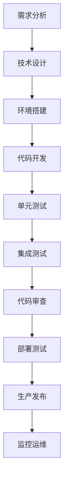

# 🌟 核心业务信息模板

## 📋 基本信息
**项目名称**: test-unified-excel  
**创建日期**: 2026-05-22  
**最后更新**: {最后更新日期}  
**项目状态**: {活跃/暂停/完成}  
**项目版本**: v1.0.0  
**项目类型**: {数据爬取/API服务/Web应用/其他}  
**项目负责人**: {负责人姓名}

## 🎯 项目目标
### 核心目标
- **主要目标**: {项目的主要业务目标}  
- **成功标准**: {衡量成功的具体可量化指标}  
- **预期成果**: {期望交付的具体成果和产出物}  
- **业务价值**: {项目为业务带来的具体价值}

### 次要目标
- {次要目标1: 在完成主要目标的基础上实现}  
- {次要目标2: 如果有额外资源或时间}  
- {技术目标: 希望实现的技术改进或学习}

### 约束条件
- **时间约束**: {项目必须在何时完成}  
- **资源约束**: {可用的人力、计算资源等}  
- **技术约束**: {必须使用的技术栈或必须避免的技术}  
- **合规约束**: {必须遵守的法律法规或公司政策}

## 🔗 关键链接
### API端点
- **主API**: {API端点URL}  
- **文档链接**: {API文档链接}  
- **测试环境**: {测试环境URL}  
- **生产环境**: {生产环境URL}  
- **监控面板**: {监控和告警链接}

### 数据源
- **数据来源**: {数据源名称/URL}  
- **数据格式**: {JSON/XML/CSV/其他}  
- **更新频率**: {实时/每日/每周/每月}  
- **历史数据**: {是否有历史数据，如何获取}  
- **数据量级**: {预计数据量大小}

### 认证信息
- **认证方式**: {OAuth/API Key/CSRF Token/用户名密码}  
- **凭据位置**: {配置文件路径，如config/api_auth.json}  
- **更新周期**: {认证信息的有效期和更新周期}  
- **权限范围**: {认证信息允许的操作范围}  
- **获取方式**: {如何获取有效的认证信息}

### 文档链接
- **项目文档**: {项目内部文档链接}  
- **技术文档**: {技术实现文档}  
- **用户手册**: {用户使用指南}  
- **API文档**: {API接口文档}  
- **部署文档**: {部署和运维文档}

## 📊 数据模型
### 核心字段（必须有的）
| 字段名 | 类型 | 描述 | 示例 | 必填 | 验证规则 |
|--------|------|------|------|------|----------|
| {field1} | string | {字段描述} | {示例值} | ✅ | {验证规则} |
| {field2} | number | {字段描述} | {示例值} | ✅ | {验证规则} |
| {field3} | date | {字段描述} | {示例值} | ✅ | {验证规则} |
| {field4} | array | {字段描述} | {示例值} | ✅ | {验证规则} |
| {field5} | object | {字段描述} | {示例值} | ✅ | {验证规则} |

### 扩展字段（推荐有的）
| 字段名 | 类型 | 描述 | 重要性 |
|--------|------|------|--------|
| {ext1} | string | {字段描述} | 高 |
| {ext2} | number | {字段描述} | 中 |
| {ext3} | boolean | {字段描述} | 低 |

### 字段映射关系
```json
{
  "标准字段名": {
    "源字段名": "{数据源中的字段名}",
    "转换函数": "{转换函数或规则}",
    "默认值": "{默认值（如果缺失）}",
    "备注": "{特殊说明}"
  }
}
```

## ⚙️ 技术配置
### API参数
```json
{
  "pagination": {
    "page_param": "{页码参数名}",
    "size_param": "{页大小参数名}",
    "default_page_size": 10,
    "max_page_size": 50,
    "total_field": "{总数字段名}",
    "current_page_field": "{当前页码字段名}"
  },
  "filtering": {
    "category_param": "{类别参数名}",
    "location_param": "{地点参数名}",
    "keyword_param": "{关键词参数名}",
    "date_range_param": "{日期范围参数名}"
  },
  "sorting": {
    "sort_param": "{排序参数名}",
    "order_param": "{顺序参数名}",
    "default_sort": "{默认排序规则}"
  }
}
```

### 筛选参数
```json
{
  "categories": [
    {"id": "1", "name": "技术类", "enabled": true},
    {"id": "2", "name": "产品类", "enabled": true},
    {"id": "3", "name": "运营类", "enabled": true},
    {"id": "4", "name": "数据类", "enabled": true},
    {"id": "5", "name": "市场拓展", "enabled": true},
    {"id": "6", "name": "销售类", "enabled": true},
    {"id": "7", "name": "游戏类", "enabled": true},
    {"id": "8", "name": "金融类", "enabled": true}
  ],
  "locations": [
    {"id": "1", "name": "北京", "enabled": true},
    {"id": "2", "name": "上海", "enabled": true},
    {"id": "3", "name": "深圳", "enabled": true},
    {"id": "4", "name": "杭州", "enabled": true},
    {"id": "5", "name": "广州", "enabled": true},
    {"id": "6", "name": "成都", "enabled": true}
  ]
}
```

### 请求配置
```json
{
  "timeout": 30,
  "max_retries": 3,
  "retry_delay": 2,
  "rate_limit": {
    "requests_per_minute": 60,
    "delay_between_requests": 1.0
  },
  "headers": {
    "User-Agent": "Mozilla/5.0 (Windows NT 10.0; Win64; x64) AppleWebKit/537.36",
    "Accept": "application/json, text/plain, */*",
    "Content-Type": "application/json"
  }
}
```

## 🚨 关键约束
### 技术约束
- **API限制**: {每分钟/每小时/每天请求数限制}  
- **数据量限制**: {每次请求最大数据量，如每页最大记录数}  
- **并发限制**: {最大并发请求数}  
- **存储限制**: {本地存储空间限制}  
- **内存限制**: {程序运行内存限制}  
- **网络限制**: {网络带宽限制}

### 业务约束
- **数据范围**: {可爬取的数据范围，如时间范围、地域范围等}  
- **使用限制**: {使用场景限制，如仅用于内部分析}  
- **更新频率**: {数据更新频率限制}  
- **数据保留**: {数据保留期限要求}

### 法律约束
- **使用条款**: {必须遵守的网站/API使用条款}  
- **隐私政策**: {必须遵守的隐私政策要求}  
- **数据保护法规**: {GDPR、个人信息保护法等}  
- **知识产权**: {尊重知识产权的约束}

### 安全约束
- **认证要求**: {必须的认证等级}  
- **数据传输**: {数据传输加密要求}  
- **数据存储**: {数据存储安全要求}  
- **访问控制**: {访问权限控制要求}

## 📈 项目指标
### 性能指标
| 指标 | 目标值 | 当前值 | 测量方法 | 监控频率 |
|------|--------|--------|----------|----------|
| **响应时间** | < 2秒 | {当前值} | 从请求到收到响应的时间 | 实时 |
| **成功率** | > 95% | {当前值} | 成功请求数/总请求数 | 每小时 |
| **数据完整性** | > 90% | {当前值} | 完整记录数/总记录数 | 每次运行 |
| **执行时间** | < 30分钟 | {当前值} | 完整爬取所需时间 | 每次运行 |
| **内存使用** | < 1GB | {当前值} | 峰值内存使用量 | 实时 |
| **CPU使用率** | < 50% | {当前值} | 平均CPU使用率 | 实时 |

### 业务指标
| 指标 | 目标值 | 当前值 | 测量方法 | 报告频率 |
|------|--------|--------|----------|----------|
| **数据覆盖率** | > 80% | {当前值} | 实际获取数据/应获取数据 | 每日 |
| **数据准确率** | > 95% | {当前值} | 准确数据/总数据 | 每周 |
| **更新及时性** | < 24小时 | {当前值} | 数据更新时间差 | 每日 |
| **用户满意度** | > 8分 | {当前值} | 用户满意度调查 | 每月 |
| **问题解决率** | > 90% | {当前值} | 已解决问题/总问题 | 每周 |

### 质量指标
| 指标 | 目标值 | 测量方法 | 改进措施 |
|------|--------|----------|----------|
| **代码覆盖率** | > 80% | 单元测试覆盖率 | 增加测试用例 |
| **代码复杂度** | < 10 | 圈复杂度分析 | 重构复杂函数 |
| **文档完整性** | > 90% | 文档检查清单 | 定期更新文档 |
| **错误率** | < 2% | 错误日志分析 | 改进错误处理 |
| **重复代码率** | < 5% | 代码重复度分析 | 提取公共函数 |

## 👥 项目团队
### 核心成员
| 角色 | 姓名 | 职责 | 联系方式 | 可用时间 |
|------|------|------|----------|----------|
| **项目经理** | {姓名} | {项目整体管理、进度跟踪} | {邮箱/电话} | {工作时间} |
| **技术负责人** | {姓名} | {技术架构、代码审查、技术决策} | {邮箱/电话} | {工作时间} |
| **开发工程师** | {姓名} | {功能开发、bug修复} | {邮箱/电话} | {工作时间} |
| **测试工程师** | {姓名} | {测试用例设计、质量保证} | {邮箱/电话} | {工作时间} |
| **业务专家** | {姓名} | {业务需求、数据验证} | {邮箱/电话} | {工作时间} |
| **运维工程师** | {姓名} | {部署、监控、运维} | {邮箱/电话} | {工作时间} |

### 联系信息
- **紧急联系人**: {姓名} ({电话}) - {仅在紧急情况下联系}  
- **技术支持**: {邮箱/微信群/钉钉群} - {技术问题咨询}  
- **问题反馈**: {反馈渠道，如GitHub Issues/Jira/内部系统}  
- **日常沟通**: {日常沟通渠道，如Slack/钉钉/企业微信}  
- **会议链接**: {定期会议链接和密码}

### 协作方式
- **代码仓库**: {GitHub/GitLab/Bitbucket链接}  
- **文档协作**: {Confluence/Notion/语雀链接}  
- **任务管理**: {Jira/Trello/Asana链接}  
- **设计稿**: {Figma/墨刀链接}  
- **API文档**: {Swagger/Postman链接}

## 📚 相关文档
### 内部文档
| 文档名称 | 链接 | 最后更新 | 负责人 | 状态 |
|----------|------|----------|--------|------|
| **项目计划** | {链接} | {日期} | {姓名} | ✅完成 |
| **技术设计** | {链接} | {日期} | {姓名} | ✅完成 |
| **API文档** | {链接} | {日期} | {姓名} | ⏳进行中 |
| **部署指南** | {链接} | {日期} | {姓名} | ✅完成 |
| **用户手册** | {链接} | {日期} | {姓名} | 📅待开始 |
| **测试计划** | {链接} | {日期} | {姓名} | ⏳进行中 |

### 外部参考
| 参考类型 | 链接 | 说明 | 最后访问 |
|----------|------|------|----------|
| **官方文档** | {链接} | {网站/API官方文档} | {日期} |
| **技术博客** | {链接} | {相关技术文章} | {日期} |
| **行业报告** | {链接} | {行业分析报告} | {日期} |
| **竞争对手** | {链接} | {竞争对手产品/方案} | {日期} |
| **开源项目** | {链接} | {类似的开源项目} | {日期} |
| **法律法规** | {链接} | {相关法律法规} | {日期} |

### 技术栈文档
| 技术组件 | 官方文档 | 中文文档 | 学习资源 |
|----------|----------|----------|----------|
| **Python** | {链接} | {链接} | {链接} |
| **Requests** | {链接} | {链接} | {链接} |
| **Pandas** | {链接} | {链接} | {链接} |
| **OpenPyXL** | {链接} | {链接} | {链接} |
| **Docker** | {链接} | {链接} | {链接} |
| **Git** | {链接} | {链接} | {链接} |

## 🔄 更新记录
### 版本历史
| 版本 | 更新日期 | 更新内容 | 更新人 | 备注 |
|------|----------|----------|--------|------|
| **v1.0.0** | {日期} | 初始版本 | {姓名} | 项目启动 |
| **v1.0.1** | {日期} | 修复API认证问题 | {姓名} | {详细说明} |
| **v1.0.2** | {日期} | 优化数据解析逻辑 | {姓名} | {详细说明} |
| **v1.0.3** | {日期} | 添加错误处理机制 | {姓名} | {详细说明} |
| **v1.1.0** | {日期} | 增加浏览器爬取方案 | {姓名} | {详细说明} |
| **v1.2.0** | {日期} | 实现数据导出功能 | {姓名} | {详细说明} |

### 重要变更
| 变更日期 | 变更内容 | 影响范围 | 负责人 | 状态 |
|----------|----------|----------|--------|------|
| {日期} | {API端点变更} | {所有API调用} | {姓名} | ✅完成 |
| {日期} | {认证方式变更} | {认证相关代码} | {姓名} | ✅完成 |
| {日期} | {数据结构变更} | {数据解析代码} | {姓名} | ⏳进行中 |
| {日期} | {部署环境变更} | {部署配置} | {姓名} | 📅计划中 |

### 待办事项
| 事项 | 优先级 | 预计完成 | 负责人 | 状态 |
|------|--------|----------|--------|------|
| {事项1} | 🔴高 | {日期} | {姓名} | ⏳进行中 |
| {事项2} | 🟡中 | {日期} | {姓名} | 📅计划中 |
| {事项3} | 🟢低 | {日期} | {姓名} | 📅计划中 |

## 🏗️ 系统架构
### 架构图
```
┌─────────────────┐    ┌─────────────────┐    ┌─────────────────┐
│   数据源        │    │   爬取引擎       │    │   数据处理      │
│   ┌─────────┐   │    │   ┌─────────┐   │    │   ┌─────────┐   │
│   │  网站    │───┼──────▶│ API爬取  │   │    │   │数据清洗 │   │
│   └─────────┘   │    │   └─────────┘   │    │   └─────────┘   │
│   ┌─────────┐   │    │   ┌─────────┐   │    │   ┌─────────┐   │
│   │  API    │───┼──────▶│浏览器爬取│   │    │   │数据验证 │   │
│   └─────────┘   │    │   └─────────┘   │    │   └─────────┘   │
└─────────────────┘    └─────────────────┘    └─────────────────┘
         │                        │                        │
         ▼                        ▼                        ▼
┌─────────────────┐    ┌─────────────────┐    ┌─────────────────┐
│   错误处理      │    │   数据存储      │    │   数据导出      │
│   ┌─────────┐   │    │   ┌─────────┐   │    │   ┌─────────┐   │
│   │重试机制 │   │    │   │ 本地文件│   │    │   │  Excel  │   │
│   └─────────┘   │    │   └─────────┘   │    │   └─────────┘   │
│   ┌─────────┐   │    │   ┌─────────┐   │    │   ┌─────────┐   │
│   │降级方案 │   │    │   │  数据库  │   │    │   │   CSV   │   │
│   └─────────┘   │    │   └─────────┘   │    │   └─────────┘   │
└─────────────────┘    └─────────────────┘    └─────────────────┘
```

### 组件说明
1. **数据源层**: 提供原始数据的网站或API
2. **爬取引擎**: 实现数据获取的核心逻辑，支持多种方式
3. **数据处理**: 对获取的数据进行清洗、验证和转换
4. **错误处理**: 处理各种异常情况，提供重试和降级
5. **数据存储**: 存储处理后的数据，支持多种存储方式
6. **数据导出**: 将数据导出为各种格式，便于使用

### 数据流
```
用户请求 → 参数验证 → 选择爬取方式 → 获取数据 → 
数据处理 → 质量检查 → 存储数据 → 导出结果 → 用户反馈
```

### 错误流
```
发生错误 → 错误分类 → 选择处理策略 → 
重试/降级/跳过 → 记录错误 → 用户通知 → 问题修复
```

## 🛠️ 开发环境
### 环境要求
| 组件 | 版本要求 | 安装方法 | 验证命令 |
|------|----------|----------|----------|
| **Python** | >= 3.8 | {安装方法} | `python --version` |
| **pip** | >= 20.0 | {安装方法} | `pip --version` |
| **Git** | >= 2.0 | {安装方法} | `git --version` |
| **Docker** | >= 20.0 | {安装方法} | `docker --version` |

### 开发工具
| 工具 | 用途 | 推荐配置 | 备注 |
|------|------|----------|------|
| **VS Code** | 代码编辑 | {配置说明} | 推荐插件列表 |
| **PyCharm** | Python开发 | {配置说明} | 专业版功能 |
| **Jupyter** | 数据分析 | {配置说明} | 交互式开发 |
| **Postman** | API测试 | {配置说明} | 接口调试 |
| **Git GUI** | Git操作 | {配置说明} | 可视化工具 |

### 开发流程


## 📞 支持与维护
### 支持级别
| 级别 | 响应时间 | 解决时间 | 支持方式 | 适用范围 |
|------|----------|----------|----------|----------|
| **P0 紧急** | 15分钟 | 4小时 | 电话/现场 | 生产环境宕机 |
| **P1 高** | 1小时 | 24小时 | 即时通讯 | 核心功能故障 |
| **P2 中** | 4小时 | 3天 | 邮件/工单 | 非核心功能问题 |
| **P3 低** | 1天 | 1周 | 文档/社区 | 功能增强建议 |

### 维护计划
| 维护类型 | 频率 | 执行时间 | 负责人 | 检查项 |
|----------|------|----------|--------|--------|
| **日常检查** | 每天 | 09:00 | {姓名} | 服务状态、错误日志 |
| **每周维护** | 每周一 | 10:00 | {姓名} | 性能分析、数据质量 |
| **月度维护** | 每月1日 | 14:00 | {姓名} | 安全更新、备份检查 |
| **季度审核** | 每季度 | 全天 | {团队} | 架构评审、技术债务 |

### 备份策略
| 备份类型 | 频率 | 保留时间 | 存储位置 | 恢复测试 |
|----------|------|----------|----------|----------|
| **数据备份** | 每天 | 30天 | {位置} | 每月一次 |
| **配置备份** | 每次变更 | 永久 | {位置} | 每季度一次 |
| **代码备份** | 每次提交 | 永久 | {位置} | 每次部署 |
| **日志备份** | 每周 | 90天 | {位置} | 每半年一次 |

---
**模板版本**: v1.0.0  
**最后更新**: {最后更新日期}  
**维护人**: {维护人姓名}  
**备注**: 这是一个通用核心业务信息模板，请根据具体项目需求进行定制。  
**重要**: 定期更新此文件，确保信息准确性和完整性。